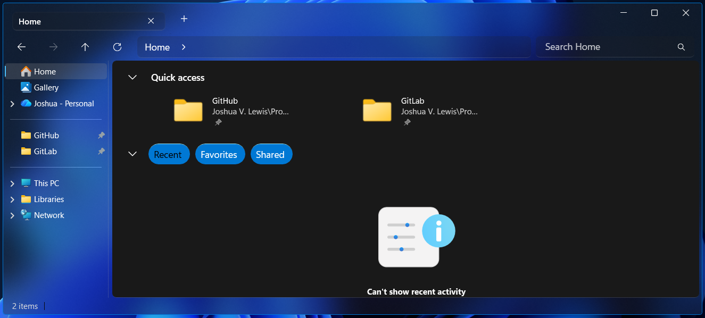

## File Explorer

> [!IMPORTANT]
> The theme styles must be imported manually for now due to the official version needing a large amount of fixes. To do that, follow these steps.

## Installation
Follow these instructions to install the Windows Glass File Explorer theme on your system.

---

### Requirements

* **Windhawk Mods**:
  * [Windows 11 File Explorer Styler](https://windhawk.net/mods/windows-11-file-explorer-styler)
  * [Translucent Windows](https://windhawk.net/mods/translucent-windows)

---

### File Explorer

<div align="center" >
 
</div>

* Open the `Windows 11 File Explorer Styler` mod in Windhawk.
* Go to the `Advanced` tab and copy the code below into the `Mod settings` box and click `save`.

<details>
<summary>Content to import (click to expand)</summary>

```json
{
"theme": "",
"controlStyles[0].target": "Microsoft.UI.Xaml.Controls.Grid#PART_LayoutRoot",
"controlStyles[0].styles[0]": "Background=Transparent",
"controlStyles[0].styles[1]": "HorizontalAlignment=Stretch",
"controlStyles[1].target": "FileExplorerExtensions.FirstCrumbStackPanelControl#FirstCrumbStackPanel",
"controlStyles[1].styles[0]": "Visibility=1",
"controlStyles[2].target": "Windows.UI.Xaml.Controls.Grid#RootCommandSearchGrid > Windows.UI.Xaml.Controls.Border#BorderElement",
"controlStyles[2].styles[0]": "Visibility=1",
"controlStyles[3].target": "Microsoft.UI.Xaml.Controls.Primitives.NavigationViewItemPresenter#NavigationViewItemPresenter > Microsoft.UI.Xaml.Controls.Grid#LayoutRoot",
"controlStyles[3].styles[0]": "BorderThickness=$BorderThickness",
"controlStyles[3].styles[1]": "Background:=$ButtonBackground",
"controlStyles[3].styles[2]": "BorderBrush:=$ButtonBorder",
"controlStyles[4].target": "Microsoft.UI.Xaml.Controls.Grid#NavigationBarControlGrid",
"controlStyles[4].styles[0]": "Background:=Transparent",
"controlStyles[4].styles[1]": "BorderBrush:=Transparent",
"controlStyles[5].target": "Microsoft.UI.Xaml.Controls.Grid#HomeViewRootGrid",
"controlStyles[5].styles[0]": "BorderBrush:=$ElementBorderBrush",
"controlStyles[5].styles[1]": "CornerRadius=$ElementCornerRadius",
"controlStyles[5].styles[2]": "BorderThickness=$ElementBorderThickness",
"controlStyles[5].styles[3]": "Margin=4,0",
"controlStyles[6].target": "FileExplorerExtensions.GalleryViewControl#GalleryViewControl > Grid  ",
"controlStyles[6].styles[0]": "BorderBrush:=$ElementBorderBrush",
"controlStyles[6].styles[1]": "CornerRadius=$ElementCornerRadius",
"controlStyles[6].styles[2]": "BorderThickness=$ElementBorderThickness",
"controlStyles[6].styles[3]": "Margin=4,0",
"controlStyles[7].target": "FileExplorerExtensions.GalleryViewControl#GalleryViewControl > Grid > Grid#GalleryRootGrid",
"controlStyles[7].styles[0]": "Background:=Transparent",
"controlStyles[8].target": "ToolTip",
"controlStyles[8].styles[0]": "Background:=$ElementBG",
"controlStyles[9].target": "Grid#TabContainerGrid > Border#LeftBottomBorderLine",
"controlStyles[9].styles[0]": "Visibility=1",
"controlStyles[10].target": "Grid#TabContainerGrid > Border#RightBottomBorderLine",
"controlStyles[10].styles[0]": "Visibility=1",
"controlStyles[11].target": "TabViewItem > Grid#LayoutRoot",
"controlStyles[11].styles[0]": "Margin=5",
"controlStyles[11].styles[1]": "Height=35",
"controlStyles[11].styles[2]": "BorderThickness=$ElementBorderThickness",
"controlStyles[11].styles[3]": "CornerRadius=$ElementCornerRadius",
"controlStyles[11].styles[4]": "BorderBrush:=$ElementBorderBrush",
"controlStyles[12].target": "TabViewItem > Grid#LayoutRoot > Canvas",
"controlStyles[12].styles[0]": "Visibility=1",
"controlStyles[13].target": "TabViewItem > Grid#LayoutRoot > Grid#TabContainer",
"controlStyles[13].styles[0]": "Background=Transparent",
"controlStyles[13].styles[1]": "BorderBrush=Transparent",
"controlStyles[14].target": "TabViewItem > Grid#LayoutRoot@CommonStates",
"controlStyles[14].styles[0]": "Background@Selected:=$ElementBG",
"controlStyles[14].styles[1]": "Background@PointerOverSelected:=$ButtonBackground",
"controlStyles[14].styles[2]": "Background@PointerOver:=$ButtonBackground",
"controlStyles[14].styles[3]": "Background@Normal:=$ElementBG",
"controlStyles[14].styles[4]": "Background@PressedSelected:=$ButtonBackground",
"controlStyles[15].target": "Grid#TabContainerGrid > Border#LeftBottomBorderLine",
"controlStyles[15].styles[0]": "Visibility=1",
"controlStyles[16].target": "Grid#TabContainerGrid > Border#RightBottomBorderLine",
"controlStyles[16].styles[0]": "Visibility=1",
"controlStyles[17].target": "Microsoft.UI.Xaml.Controls.Border#BottomBorderLine",
"controlStyles[17].styles[0]": "Visibility=1",
"controlStyles[18].target": "Microsoft.UI.Xaml.Shapes.Path#LeftRadiusRenderArc",
"controlStyles[18].styles[0]": "Visibility=1",
"controlStyles[19].target": "Microsoft.UI.Xaml.Shapes.Path#RightRadiusRenderArc",
"controlStyles[19].styles[0]": "Visibility=1",
"controlStyles[20].target": "Microsoft.UI.Xaml.Controls.Grid#TabContainer",
"controlStyles[20].styles[0]": "Visibility=0",
"controlStyles[21].target": "Microsoft.UI.Xaml.Controls.Viewbox#IconBox",
"controlStyles[21].styles[0]": "Visibility=1",
"controlStyles[22].target": "CommandBarOverflowPresenter#SecondaryItemsControl > Grid#LayoutRoot",
"controlStyles[22].styles[0]": "Background:=$ElementBG",
"controlStyles[22].styles[1]": "BorderThickness=$ElementBorderThickness",
"controlStyles[22].styles[2]": "BorderBrush:=$ElementBorderBrush",
"controlStyles[22].styles[3]": "CornerRadius=$ElementCornerRadius",
"controlStyles[23].target": "Microsoft.UI.Xaml.Controls.AutoSuggestBox#FileExplorerSearchBox > Microsoft.UI.Xaml.Controls.Grid#LayoutRoot > Microsoft.UI.Xaml.Controls.TextBox#TextBox",
"controlStyles[23].styles[0]": "CornerRadius=$ElementCornerRadius",
"controlStyles[23].styles[1]": "Background:=$ElementBG",
"controlStyles[23].styles[2]": "BorderBrush:=$ElementBorderBrush",
"controlStyles[23].styles[3]": "BorderThickness=$ElementBorderThickness",
"controlStyles[24].target": "Microsoft.UI.Xaml.Controls.Grid#FileExplorerAddressBarGrid",
"controlStyles[24].styles[0]": "CornerRadius=$ElementCornerRadius",
"controlStyles[24].styles[1]": "Background:=$ElementBG",
"controlStyles[24].styles[2]": "BorderBrush:=$ElementBorderBrush",
"controlStyles[24].styles[3]": "BorderThickness=$ElementBorderThickness",
"controlStyles[25].target": "Microsoft.UI.Xaml.Controls.AutoSuggestBox#PART_AutoSuggestBox > Microsoft.UI.Xaml.Controls.Grid#LayoutRoot > Microsoft.UI.Xaml.Controls.TextBox#TextBox",
"controlStyles[25].styles[0]": "CornerRadius=$ElementCornerRadius",
"controlStyles[26].target": "Microsoft.UI.Xaml.Controls.Grid#RootContainer",
"controlStyles[26].styles[0]": "Background:=Transparent",
"controlStyles[27].target": "Microsoft.UI.Xaml.Controls.Border > Microsoft.UI.Xaml.Controls.Button#AddButton",
"controlStyles[27].styles[0]": "RenderTransform:=<TranslateTransform Y=\"-8\" />",
"controlStyles[28].target": "Microsoft.UI.Xaml.Controls.TextBlock#TextLabel",
"controlStyles[28].styles[0]": "Visibility=1",
"controlStyles[29].target": "Microsoft.UI.Xaml.Controls.Grid#SubItemChevronPanel > Microsoft.UI.Xaml.Controls.FontIcon#SubItemChevron",
"controlStyles[29].styles[0]": "RenderTransform:=<TranslateTransform X=\"-5\" Y=\"12\" />",
"styleConstants[0]": "Background=<WindhawkBlur BlurAmount=\"15\" TintColor=\"#25323232\" TintOpacity=\"0.2\" />",
"styleConstants[1]": "MainContentBG=<SolidColorBrush Color=\"{ThemeResource SystemChromeAltHighColor}\" Opacity=\"1\" />",
"styleConstants[2]": "ButtonBackground=<SolidColorBrush Color=\"{ThemeResource SystemAccentColor}\" Opacity=\"1\" />",
"styleConstants[3]": "BorderThickness=0.3,1,0.3,0.3",
"styleConstants[4]": "ClockBG=<WindhawkBlur BlurAmount=\"20\" TintColor=\"{ThemeResource SystemAccentColorLight2}\" TintOpacity=\"0.3\" />",
"styleConstants[5]": "ElementBG=<WindhawkBlur BlurAmount=\"20\" TintColor=\"#202020\" TintOpacity=\"0.2\" />",
"styleConstants[6]": "ElementBorderThickness=0.3,0.3,0.3,1",
"styleConstants[7]": "ElementBorderBrush=<LinearGradientBrush StartPoint=\"0,0\" EndPoint=\"0,1\"><GradientStop Color=\"#50808080\" Offset=\"1\" /><GradientStop Color=\"#50606060\" Offset=\"0.15\" /></LinearGradientBrush>",
"styleConstants[8]": "BorderBrush=<LinearGradientBrush StartPoint=\"0,0\" EndPoint=\"0,1\"><GradientStop Color=\"#50808080\" Offset=\"0.0\" /><GradientStop Color=\"#50404040\" Offset=\"0.25\" /><GradientStop Color=\"#50808080\" Offset=\"1\" /></LinearGradientBrush>",
"styleConstants[9]": "ButtonBorder=<SolidColorBrush Color=\"{ThemeResource SystemAccentColorLight3}\" Opacity=\"1\" />",
"styleConstants[10]": "CornerRadius=10",
"styleConstants[11]": "ElementCornerRadius=6",
"resourceVariables[0].variableKey": "",
"resourceVariables[0].value": "",
"explorerFrameContainerHeight": 87,
"controlStyles[8].styles[1]": "BorderBrush:=$ElementBorderBrush",
"controlStyles[8].styles[2]": "BorderThickness=$ElementBorderThickness",
"controlStyles[8].styles[3]": "CornerRadius=$ElementCornerRadius",
"controlStyles[30].target": "TabViewItem > Grid#LayoutRoot",
"controlStyles[30].styles[0]": "Height = 28",
"controlStyles[31].target": "TabViewItem > Grid#LayoutRoot > Canvas",
"controlStyles[31].styles[0]": "Visibility=1",
"controlStyles[32].target": "FileExplorerExtensions.CommandBarControl",
"controlStyles[32].styles[0]": "Visibility=1",
"controlStyles[33].target": "FileExplorerExtensions.NavigationBarControl",
"controlStyles[33].styles[0]": "Grid.RowSpan=2",
"controlStyles[33].styles[1]": "Margin=0,0,0,1",
"controlStyles[34].target": "Grid#DetailsViewControlRootGrid",
"controlStyles[35].target": "StackPanel#DetailsViewThumbnail",
"controlStyles[34].styles[0]": "Background:=Transparent",
"controlStyles[35].styles[0]": "Background:=Transparent"
}
```

</details>

---

### Translucent Windows

* Open the `Translucent Windows` mod in Windhawk.
* Go to the `Advanced` tab and copy the code below into the `Mod settings` box and click `save`.

<details>
<summary>Content to import (click to expand)</summary>

```json
{
"RenderingMod.ThemeBackground": 1,
"RenderingMod.SysColors": 0,
"RenderingMod.AccentColorControls": 1,
"type": "acrylicblur",
"AccentBlurBehind": "3A232323",
"FlyoutsEffects": 1,
"ImmersiveDarkTitle": 1,
"ExtendFrame": 1,
"CornerOption": "smallround",
"RainbowSpeed": 1,
"TitlebarColor.ColorTitlebar": 0,
"TitlebarColor.RainbowTitlebar": 0,
"TitlebarColor.titlerbarstyles_active": "FF0000",
"TitlebarColor.titlerbarstyles_inactive": "00FFFF",
"TitlebarTextColor.ColorTitlebarText": 0,
"TitlebarTextColor.RainbowTextColor": 0,
"TitlebarTextColor.titlerbarcolorstyles_active": "FF0000",
"TitlebarTextColor.titlerbarcolorstyles_inactive": "00FFFF",
"BorderColor.ColorBorder": 0,
"BorderColor.RainbowBorder": 0,
"BorderColor.borderstyles_active": "FF0000",
"BorderColor.borderstyles_inactive": "00FFFF",
"RuledPrograms[0].target": "",
"RuledPrograms[0].RenderingMod.ThemeBackground": 0,
"RuledPrograms[0].RenderingMod.AccentColorControls": 0,
"RuledPrograms[0].type": "",
"RuledPrograms[0].AccentBlurBehind": "",
"RuledPrograms[0].ImmersiveDarkTitle": 0,
"RuledPrograms[0].ExtendFrame": 0,
"RuledPrograms[0].CornerOption": "",
"RuledPrograms[0].RainbowSpeed": 0,
"RuledPrograms[0].TitlebarColor.ColorTitlebar": 0,
"RuledPrograms[0].TitlebarColor.RainbowTitlebar": 0,
"RuledPrograms[0].TitlebarColor.titlerbarstyles_active": "",
"RuledPrograms[0].TitlebarColor.titlerbarstyles_inactive": "",
"RuledPrograms[0].TitlebarTextColor.ColorTitlebarText": 0,
"RuledPrograms[0].TitlebarTextColor.RainbowTextColor": 0,
"RuledPrograms[0].TitlebarTextColor.titlerbarcolorstyles_active": "",
"RuledPrograms[0].TitlebarTextColor.titlerbarcolorstyles_inactive": "",
"RuledPrograms[0].BorderColor.ColorBorder": 0,
"RuledPrograms[0].BorderColor.RainbowBorder": 0,
"RuledPrograms[0].BorderColor.borderstyles_active": "",
"RuledPrograms[0].BorderColor.borderstyles_inactive": ""
}
```

</details>
