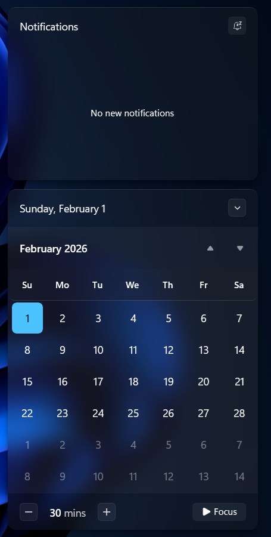
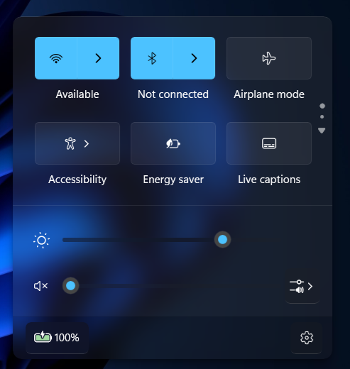

# Notification Center

> [!IMPORTANT]
> The theme styles must be imported manually for now due to the official version needing a large amount of fixes. To do that, follow these steps.

## Installation
Follow the instructions listed below to install and setup the Windows Glass Notification Center theme on your system.

---

### Requirements

* **Windhawk Mods**:
  * [Windows 11 Notification Center Styler](https://windhawk.net/mods/windows-11-notification-center-styler)
  * [Shell Flyout Positions](https://windhawk.net/mods/shell-flyout-positions)

---

### Notification Center

<div align="center">
 
</div>

* Open the `Windows 11 Notification Center Styler` mod in Windhawk.
* Go to the `Advanced` tab and copy the code below into the `Mod settings` box and click `save`.

<details>
<summary>Content to import (click to expand)</summary>

```json
{
"theme": "",
"controlStyles[0].target": "Grid#NotificationCenterGrid",
"controlStyles[0].styles[0]": "// Visibility=1",
"controlStyles[0].styles[1]": "Background:=$Background",
"controlStyles[0].styles[2]": "BorderBrush:=$BorderBrush",
"controlStyles[0].styles[3]": "CornerRadius=$CornerRadius",
"controlStyles[0].styles[4]": "BorderThickness=$BorderThickness",
"controlStyles[0].styles[5]": "VerticalAlignment=2",
"controlStyles[1].target": "Grid#CalendarCenterGrid",
"controlStyles[1].styles[0]": "Background:=$Background",
"controlStyles[1].styles[1]": "BorderBrush:=$BorderBrush",
"controlStyles[1].styles[2]": "BorderThickness=$BorderThickness",
"controlStyles[1].styles[3]": "CornerRadius=$CornerRadius",
"controlStyles[2].target": "Border#CalendarHeaderMinimizedOverlay",
"controlStyles[2].styles[0]": "Background:=$Background",
"controlStyles[2].styles[1]": "CornerRadius-$CornerRadius",
"controlStyles[2].styles[2]": "Height=45",
"controlStyles[2].styles[3]": "BorderBrush:=$BorderBrush",
"controlStyles[2].styles[4]": "BorderThickness=$BorderThickness",
"controlStyles[3].target": "CalendarViewDayItem",
"controlStyles[3].styles[0]": "CornerRadius=$ElementCornerRadius",
"controlStyles[4].target": "Control",
"controlStyles[4].styles[0]": "CornerRadius=$ElementCornerRadius",
"controlStyles[5].target": "CalendarViewDayItem > Border",
"controlStyles[5].styles[0]": "CornerRadius=$ElementCornerRadius",
"controlStyles[5].styles[1]": "BorderBrush:=Transparent",
"controlStyles[6].target": "Control > Border",
"controlStyles[6].styles[0]": "CornerRadius=$ElementCornerRadius",
"controlStyles[6].styles[1]": "BorderBrush:=Transparent",
"controlStyles[7].target": "Grid#ControlCenterRegion",
"controlStyles[7].styles[0]": "CornerRadius=$CornerRadius",
"controlStyles[7].styles[1]": "BorderThickness=$BorderThickness",
"controlStyles[7].styles[2]": "BorderBrush:=$BorderBrush",
"controlStyles[7].styles[3]": "Background:=$Background",
"controlStyles[8].target": "Button#ClearAll",
"controlStyles[8].styles[0]": "AccessKey=x",
"controlStyles[9].target": "Button#ExpandCollapseButton",
"controlStyles[9].styles[0]": "AccessKey=e",
"controlStyles[10].target": "ActionCenter.FocusSessionControl#FocusSessionControl > Grid#FocusGrid",
"controlStyles[10].styles[0]": "Background:=Transparent",
"controlStyles[10].styles[1]": "BorderBrush:=Transparent",
"controlStyles[11].target": "MenuFlyoutPresenter",
"controlStyles[11].styles[0]": "CornerRadius=$CornerRadius",
"controlStyles[11].styles[1]": "BorderBrush:=$BorderBrush",
"controlStyles[11].styles[2]": "BorderThickness=$BorderThickness",
"controlStyles[11].styles[3]": "Background:=$Background",
"controlStyles[12].target": "ScrollViewer#ListContent",
"controlStyles[12].styles[0]": "Background:=Transparent",
"controlStyles[12].styles[1]": "BorderBrush:=Transparent",
"controlStyles[13].target": "ActionCenter.FlexibleToastView#FlexibleNormalToastView",
"controlStyles[13].styles[0]": "Background:=Transparent",
"controlStyles[14].target": "Border#ToastBackgroundBorder2",
"controlStyles[14].styles[0]": "Background:=$Background",
"controlStyles[14].styles[1]": "CornerRadius=$CornerRadius",
"controlStyles[15].target": "Grid#WeekDayNames",
"controlStyles[15].styles[0]": "Background:=$ElementBG",
"controlStyles[15].styles[1]": "BorderBrush:=$ElementBorderBrush",
"controlStyles[15].styles[2]": "BorderThickness=$ElementBorderThickness",
"controlStyles[15].styles[3]": "CornerRadius=$ElementCornerRadius",
"controlStyles[16].target": "ScrollBar#VerticalScrollBar",
"controlStyles[16].styles[0]": "Visibility=1",
"controlStyles[17].target": "Button#VolumeL2Button[AutomationProperties.Name = Select a sound output] > ContentPresenter#ContentPresenter",
"controlStyles[17].styles[0]": "CornerRadius=$ElementCornerRadius",
"controlStyles[17].styles[1]": "Background:=$ElementBG",
"controlStyles[17].styles[2]": "BorderBrush:=$ElementBorderBrush",
"controlStyles[17].styles[3]": "BorderThickness=$ElementBorderThickness",
"controlStyles[18].target": "Button#FooterButton[AutomationProperties.Name = All settings] > ContentPresenter#ContentPresenter",
"controlStyles[18].styles[0]": "CornerRadius=$ElementCornerRadius",
"controlStyles[18].styles[1]": "Background:=$ElementBG",
"controlStyles[18].styles[2]": "BorderBrush:=$ElementBorderBrush",
"controlStyles[18].styles[3]": "BorderThickness=$ElementBorderThickness",
"controlStyles[19].target": "Button[AutomationProperties.AutomationId = Microsoft.QuickAction.Battery] > ContentPresenter#ContentPresenter",
"controlStyles[19].styles[0]": "CornerRadius=$ElementCornerRadius",
"controlStyles[19].styles[1]": "Background:=$ElementBG",
"controlStyles[19].styles[2]": "BorderBrush:=$ElementBorderBrush",
"controlStyles[19].styles[3]": "BorderThickness=$ElementBorderThickness",
"controlStyles[20].target": "Button#FooterButton[AutomationProperties.Name = Edit quick settings]",
"controlStyles[20].styles[0]": "CornerRadius=$ElementCornerRadius",
"controlStyles[20].styles[1]": "Background:=$ElementBG",
"controlStyles[20].styles[2]": "BorderBrush:=$ElementBorderBrush",
"controlStyles[20].styles[3]": "BorderThickness=$ElementBorderThickness",
"controlStyles[21].target": "Rectangle#HorizontalTrackRect",
"controlStyles[21].styles[0]": "Fill:=$ElementBG",
"controlStyles[21].styles[1]": "Height=5",
"controlStyles[22].target": "Rectangle#HorizontalDecreaseRect",
"controlStyles[22].styles[0]": "Fill:=$AccentBG",
"controlStyles[22].styles[1]": "Height=5",
"controlStyles[23].target": "Grid#AlbumTextAndArtContainer",
"controlStyles[23].styles[0]": "Height=55",
"controlStyles[23].styles[1]": "MaxWidth:=150",
"controlStyles[23].styles[2]": "Width=Auto",
"controlStyles[23].styles[3]": "Background:=Transparent",
"controlStyles[23].styles[4]": "BorderBrush:=Transparent",
"controlStyles[23].styles[5]": "HorizontalAlignment=Left",
"controlStyles[24].target": "Grid#ThumbnailImage",
"controlStyles[24].styles[0]": "Visibility=1",
"controlStyles[25].target": "StackPanel#PrimaryAndSecondaryTextContainer",
"controlStyles[25].styles[0]": "VerticalAlignment=Center",
"controlStyles[25].styles[1]": "HorizontalAlignment=Left",
"controlStyles[26].target": "StackPanel#PrimaryAndSecondaryTextContainer > TextBlock#Title",
"controlStyles[26].styles[0]": "TextAlignment=Center",
"controlStyles[26].styles[1]": "FontSize=18",
"controlStyles[27].target": "StackPanel#PrimaryAndSecondaryTextContainer >TextBlock#Subtitle",
"controlStyles[27].styles[0]": "TextAlignment=Center",
"controlStyles[27].styles[1]": "FontFamily=vivo Sans EN VF",
"controlStyles[27].styles[2]": "Margin=0,3,0,0",
"controlStyles[27].styles[3]": "FontWeight=600",
"controlStyles[28].target": "ListView#MediaButtonsListView",
"controlStyles[28].styles[0]": "VerticalAlignment=Center",
"controlStyles[28].styles[1]": "Height=20",
"controlStyles[28].styles[2]": "Margin=130,-60,0,0",
"controlStyles[28].styles[3]": "Width=Auto",
"controlStyles[28].styles[4]": "HorizontalAlignment=Right",
"controlStyles[29].target": "Windows.UI.Xaml.Controls.Primitives.RepeatButton#PreviousButton",
"controlStyles[29].styles[0]": "Width=40",
"controlStyles[29].styles[1]": "Height=40",
"controlStyles[29].styles[2]": "Margin=10,0,0,0",
"controlStyles[30].target": "Button#PlayPauseButton",
"controlStyles[30].styles[0]": "Width=40",
"controlStyles[30].styles[1]": "Height=40",
"controlStyles[30].styles[2]": "Margin=0",
"controlStyles[31].target": "Windows.UI.Xaml.Controls.Primitives.RepeatButton#NextButton",
"controlStyles[31].styles[0]": "Width=40",
"controlStyles[31].styles[1]": "Height=30",
"controlStyles[31].styles[2]": "Margin=0,0,10,0",
"controlStyles[32].target": "TextBlock#AppNameText",
"controlStyles[32].styles[0]": "FontFamily=vivo Sans EN VF",
"controlStyles[32].styles[1]": "FontSize=16",
"controlStyles[33].target": "Image#IconImage",
"controlStyles[33].styles[0]": "Height=20",
"controlStyles[33].styles[1]": "Width=20",
"controlStyles[34].target": "Grid#MediaTransportControlsRegion",
"controlStyles[34].styles[0]": "Height=125",
"controlStyles[34].styles[1]": "Background:=$Background",
"controlStyles[34].styles[2]": "BorderBrush:=$BorderBrush",
"controlStyles[34].styles[3]": "BorderThickness=$BorderThickness",
"controlStyles[34].styles[4]": "CornerRadius=$CornerRadius",
"controlStyles[35].target": "Grid > Border#ItemOpaquePlating",
"controlStyles[35].styles[0]": "Background:=$Background",
"controlStyles[35].styles[1]": "BorderBrush:=$BorderBrush",
"controlStyles[35].styles[2]": "BorderThickness=$BorderThickness",
"controlStyles[35].styles[3]": "CornerRadius=$CornerRadius",
"controlStyles[36].target": "JumpViewUI.SystemItemListViewItem > Grid#LayoutRoot > Border#BackgroundBorder",
"controlStyles[36].styles[0]": "Background:=$ElementBG",
"controlStyles[36].styles[1]": "BorderBrush:=$ElementBorderBrush",
"controlStyles[36].styles[2]": "BorderThickness=$ElementBorderThickness",
"controlStyles[36].styles[3]": "CornerRadius=$ElementCornerRadius",
"controlStyles[37].target": "JumpViewUI.JumpListListViewItem > Grid#LayoutRoot > Border#BackgroundBorder",
"controlStyles[37].styles[0]": "Background:=$ElementBG",
"controlStyles[37].styles[1]": "BorderBrush:=$ElementBorderBrush",
"controlStyles[37].styles[2]": "BorderThickness=$ElementBorderThickness",
"controlStyles[37].styles[3]": "CornerRadius=$ElementCornerRadius",
"controlStyles[38].target": "QuickActions.AccessibleToggleButton#ToggleButton",
"controlStyles[38].styles[0]": "Background:=$ElementBG",
"controlStyles[38].styles[1]": "BorderBrush:=$ElementBorderBrush",
"controlStyles[38].styles[2]": "BorderThickness=$ElementBorderThickness",
"controlStyles[38].styles[3]": "CornerRadius=$ElementCornerRadius",
"controlStyles[39].target": "QuickActions.AccessibleToggleButton#SplitL2Button",
"controlStyles[39].styles[0]": "Background:=$ElementBG",
"controlStyles[39].styles[1]": "BorderBrush:=$ElementBorderBrush",
"controlStyles[39].styles[2]": "BorderThickness=$ElementBorderThickness",
"controlStyles[39].styles[3]": "CornerRadius=$ElementCornerRadius",
"styleConstants[0]": "Background=<WindhawkBlur BlurAmount=\"15\" TintColor=\"#25323232\" TintOpacity=\"0.2\" />",
"styleConstants[1]": "BorderThickness=0.3,1,0.3,0.3",
"styleConstants[2]": "ElementBG=<WindhawkBlur BlurAmount=\"20\" TintColor=\"#202020\" TintOpacity=\"0.2\" />",
"styleConstants[3]": "ElementBorderThickness=0.3,0.3,0.3,1",
"styleConstants[4]": "ElementBorderBrush=<LinearGradientBrush StartPoint=\"0,0\" EndPoint=\"0,1\"><GradientStop Color=\"#50808080\" Offset=\"1\" /><GradientStop Color=\"#50606060\" Offset=\"0.15\" /></LinearGradientBrush>",
"styleConstants[5]": "BorderBrush=<LinearGradientBrush StartPoint=\"0,0\" EndPoint=\"0,1\"><GradientStop Color=\"#50808080\" Offset=\"0.0\" /><GradientStop Color=\"#50404040\" Offset=\"0.25\" /><GradientStop Color=\"#50808080\" Offset=\"1\" /></LinearGradientBrush>",
"styleConstants[6]": "CornerRadius=10",
"styleConstants[7]": "ElementCornerRadius=6",
"styleConstants[8]": "AccentBG=<WindhawkBlur BlurAmount=\"20\" TintColor=\"{ThemeResource SystemAccentColorLight}\" TintOpacity=\"0.2\" />",
"resourceVariables[0].variableKey": "",
"resourceVariables[0].value": ""
}
```

</details>

---

### Shell Fylout Positions

* Open the `Shell Flyout Positions` mod in Windhawk
* Go to the `Advanced` tab and copy the code below into the `Mod settings` box and click `save`.

<details>
<summary>Content to import (click to expand)</summary>

```json
{
"notificationCenter.horizontalAlignment": "tray",
"notificationCenter.horizontalShift": 0,
"actionCenter.horizontalAlignment": "same",
"actionCenter.horizontalShift": 0
}
```

</details>