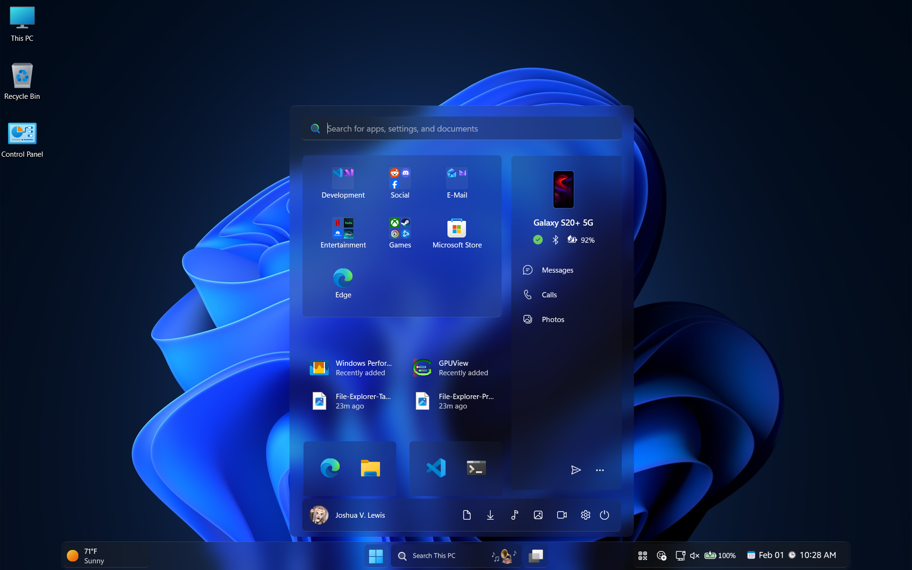
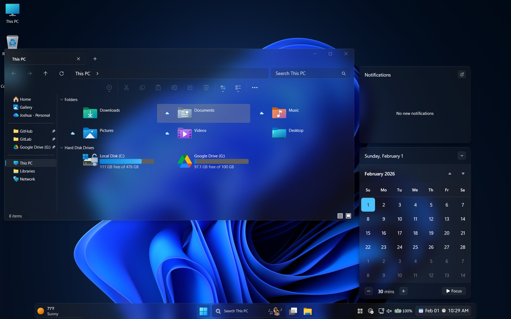

<div align="center">

# Improved Windows Glass Theme

<div align="center">
 
</div>

</div>

> [!IMPORTANT]
> This theme supports 16:9 or 16:10 screen reolutions with a DPI of 100% *(Tested on 1920x1080 and 1920x1200)*. Using it on anything else may result in overlapping elements. High DPI and Miminal variations are included to extend support further.

<div align="center">

#### If you'd like to help, feel free to open a PR with your improvements and/or fixes!<br />You can see a list of currently planned changes in our [TO-DO](/TO-DO.md) page.

</div>

## Instructions
Follow the instructions listed below to learn how to setup the  Windows Glass theme.

1. Open Windhawk and go to `Settings > Advanced settings > More advanced settings` and copy the code below into the `Process exclusion list` in order to exclude MS Office apps; This resolves various issues by preventing Windhawk from modifying MS Office apps.

    <details>
    <summary>Content to import (click to expand)</summary>

    ```
    *\Microsoft Office\*
    winword.exe
    excel.exe
    powerpnt.exe
    olk.exe
    outlook.exe
    ms-teams.exe
    onenote.exe
    onenotem.exe
    excel.exe
    mspub.exe
    msaccess.exe
    teams.exe
    OfficeClickToRun.exe
    ```

    </details>

2. Follow the instructions listed below to setup each different section of the Windows Glass theme.
    * [Start Menu](/Start%20Menu/README.md) - Instructions for setting up the Windows Glass Start Menu theme.
    * [Taskbar](/Taskbar/README.md) - Instructions for setting up the Windows Glass Taskbar theme.
    * [Notification Center](/Notification%20Center/README.md) - Instructions for setting up the Windows Glass Notification Center theme.
    * [File Explorer](/File%20Explorer/README.md) - Instructions for setting up the Windows Glass File Explorer theme.
