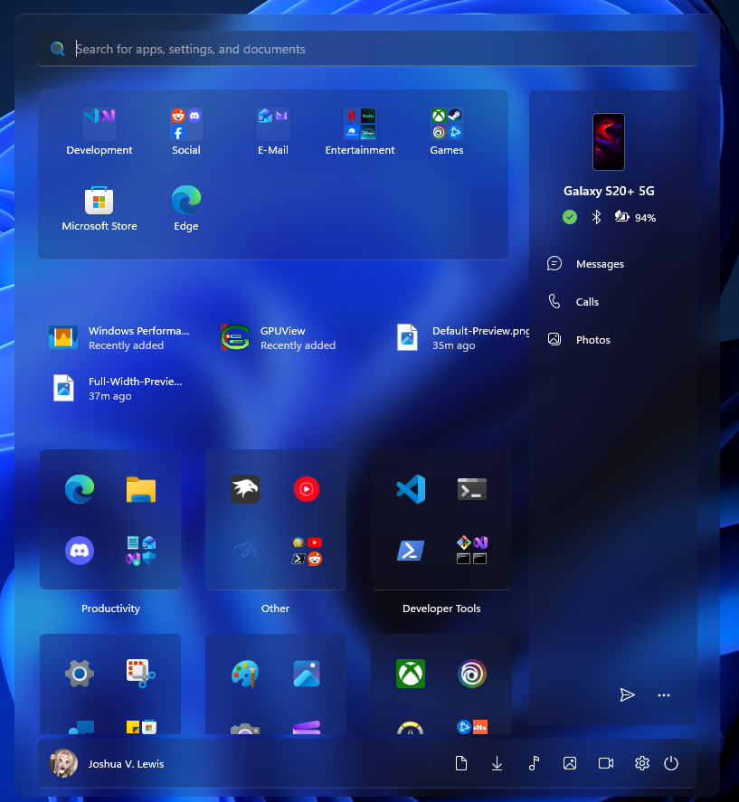
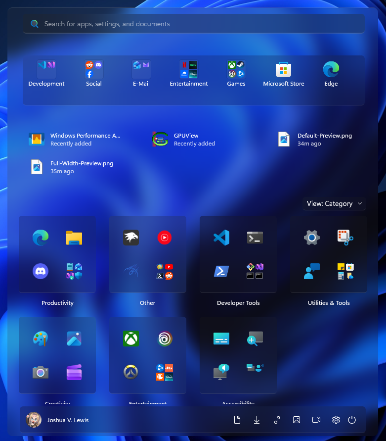
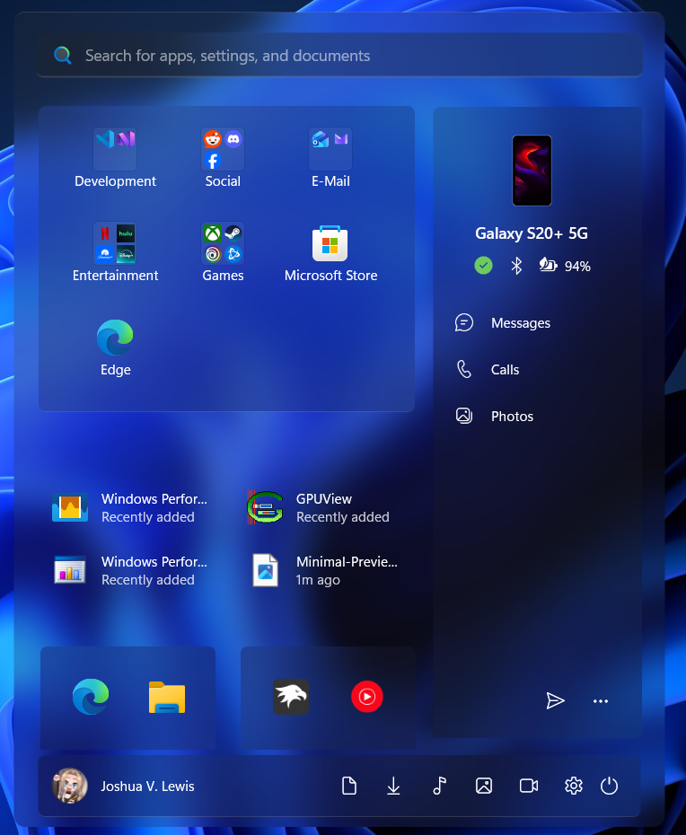

# Start Menu

> [!IMPORTANT]
> The theme styles must be imported manually for now due to the official version needing a large amount of fixes. To do that, follow these steps.

## Installation
Follow the instructions listed below to install and setup the Windows Glass Start Menu theme on your system.

### Requirements

* **Windhawk Mods**:  
  * [Windows 11 Start Menu Styler](https://windhawk.net/mods/windows-11-start-menu-styler)

---

### Default Start Menu



* Download and install the fonts listed in the requirements above.
* Open the `Windows 11 Start Menu Styler` mod in Windhawk.
* Go to the `Advanced` taband add `LockApp.exe` to the `Custom process inclusion list`. Then copy the code below into the `Mod settings` box and click `save`.

<details>
<summary>Content to import (click to expand)</summary>

```json
{
"theme": "",
"disableNewStartMenuLayout": 0,
"controlStyles[0].target": "Border#AcrylicOverlay",
"controlStyles[0].styles[0]": "Visibility=1",
"controlStyles[1].target": "Border#AcrylicBorder",
"controlStyles[1].styles[0]": "Background:=$Background",
"controlStyles[1].styles[1]": "BorderThickness=$BorderThickness",
"controlStyles[1].styles[2]": "BorderBrush:=$BorderBrush",
"controlStyles[1].styles[3]": "CornerRadius=$CornerRadius",
"controlStyles[1].styles[4]": "MaxWidth=780",
"controlStyles[1].styles[5]": "Width=Auto",
"controlStyles[1].styles[6]": "RenderTransform:=<TranslateTransform X=\"10\" Y=\"4\" />",
"controlStyles[2].target": "Border#AppBorder",
"controlStyles[2].styles[0]": "Background:=$Background",
"controlStyles[2].styles[1]": "BorderBrush:=$BorderBrush",
"controlStyles[2].styles[2]": "BorderThickness=$BorderThickness",
"controlStyles[2].styles[3]": "CornerRadius=$CornerRadius",
"controlStyles[3].target": "Border#DropShadow",
"controlStyles[3].styles[0]": "Visibility=1",
"controlStyles[4].target": "Border#StartDropShadow",
"controlStyles[4].styles[0]": "Visibility=1",
"controlStyles[5].target": "Border#RightCompanionDropShadow",
"controlStyles[5].styles[0]": "Visibility=1",
"controlStyles[6].target": "StartMenu.SearchBoxToggleButton#SearchBoxToggleButton",
"controlStyles[6].styles[0]": "Visibility=0",
"controlStyles[6].styles[1]": "Height=40",
"controlStyles[6].styles[2]": "RenderTransform:=<TranslateTransform X=\"8\" Y=\"10\" />",
"controlStyles[6].styles[3]": "HorizontalAlignment=Stretch",
"controlStyles[6].styles[4]": "Margin=20,0",
"controlStyles[7].target": "Cortana.UI.Views.RichSearchBoxControl#SearchBoxControl",
"controlStyles[7].styles[0]": "HorizontalAlignment=Stretch",
"controlStyles[8].target": "Border#BorderElement",
"controlStyles[8].styles[0]": "Background:=$ElementBG",
"controlStyles[8].styles[1]": "BorderBrush:=$ElementBorderBrush",
"controlStyles[8].styles[2]": "BorderThickness=$ElementBorderThickness",
"controlStyles[8].styles[3]": "CornerRadius=$ElementCornerRadius",
"controlStyles[9].target": "StartMenu.CategoryControl > Grid#RootGrid > Border ",
"controlStyles[9].styles[0]": "BorderThickness=$ElementBorderThickness",
"controlStyles[9].styles[1]": "BorderBrush:=$ElementBorderBrush",
"controlStyles[9].styles[2]": "Background:=$ElementBG",
"controlStyles[9].styles[3]": "CornerRadius=$ElementCornerRadius",
"controlStyles[10].target": "Border#BorderUnderline",
"controlStyles[10].styles[0]": "Visibility=0",
"controlStyles[11].target": "StackPanel#TimeAndDatePanel",
"controlStyles[11].styles[0]": "VerticalAlignment=Top",
"controlStyles[11].styles[1]": "HorizontalAlignment=Center",
"controlStyles[11].styles[2]": "RenderTransform:=<TranslateTransform X=\"0\" />",
"controlStyles[12].target": "StackPanel#TimePanel > TextBlock#Time",
"controlStyles[12].styles[0]": "HorizontalAlignment=Center",
"controlStyles[12].styles[1]": "RenderTransform:=<TranslateTransform X=\"0\" Y=\"50\" />",
"controlStyles[12].styles[2]": "FontFamily=vivo Sans Clock Stencil Regular",
"controlStyles[12].styles[3]": "Foreground:=$ClockBG",
"controlStyles[13].target": "StackPanel#TimeAndDatePanel > TextBlock#Date",
"controlStyles[13].styles[0]": "HorizontalAlignment=Center",
"controlStyles[13].styles[1]": "RenderTransform:=<TranslateTransform X=\"0\" Y=\"-150\" />",
"controlStyles[13].styles[2]": "FontFamily=vivo Sans EN VF",
"controlStyles[13].styles[3]": "Foreground:=$ClockBG",
"controlStyles[14].target": "Grid#WidgetFrameGrid",
"controlStyles[14].styles[0]": "Background:=$Background",
"controlStyles[14].styles[1]": "BorderBrush:=$BorderBrush",
"controlStyles[14].styles[2]": "BorderThickness=$BorderThickness",
"controlStyles[14].styles[3]": "CornerRadius=$CornerRadius",
"controlStyles[15].target": "Grid#WidgetCanvasPanel",
"controlStyles[15].styles[0]": "HorizontalAlignment=Center",
"controlStyles[15].styles[1]": "RenderTransform:=<TranslateTransform X=\"0\" Y=\"50\" />",
"controlStyles[16].target": "Grid#MediaTransportControls",
"controlStyles[16].styles[0]": "Background:=$Background",
"controlStyles[16].styles[1]": "BorderBrush:=$BorderBrush",
"controlStyles[16].styles[2]": "BorderThickness=$BorderThickness",
"controlStyles[16].styles[3]": "CornerRadius=$CornerRadius",
"controlStyles[17].target": "Grid#MediaControlsContainer",
"controlStyles[17].styles[0]": "Visibility=0",
"controlStyles[17].styles[1]": "RenderTransform:=<TranslateTransform X=\"0\" Y=\"-200\" />",
"controlStyles[17].styles[2]": "Margin=0,0,0,0",
"controlStyles[18].target": "Windows.UI.Xaml.Controls.Primitives.ToggleButton#ShowHideCompanion",
"controlStyles[18].styles[0]": "Visibility=1",
"controlStyles[19].target": "Grid#CompanionRoot > Border#AcrylicOverlay",
"controlStyles[19].styles[0]": "BorderThickness=$ElementBorderThickness",
"controlStyles[19].styles[1]": "CornerRadius=$ElementCornerRadius",
"controlStyles[19].styles[2]": "BorderBrush:=$ElementBorderBrush",
"controlStyles[19].styles[3]": "Background:=$ElementBG",
"controlStyles[20].target": "Grid#Root > Border",
"controlStyles[20].styles[0]": "BorderBrush:=$BorderBrush",
"controlStyles[20].styles[1]": "Background:=$Background",
"controlStyles[20].styles[2]": "BorderThickness=$BorderThickness",
"controlStyles[20].styles[3]": "CornerRadius=$CornerRadius",
"controlStyles[21].target": "Border#RightCompanionDropShadow",
"controlStyles[21].styles[0]": "Visibility=1",
"controlStyles[22].target": "Grid#RightCompanionContainerGrid",
"controlStyles[22].styles[0]": "Margin=-420,85,0,75",
"controlStyles[22].styles[1]": "RenderTransform:=<TranslateTransform X=\"68\" />",
"controlStyles[22].styles[2]": "Width=200",
"controlStyles[22].styles[3]": "Visibility=0",
"controlStyles[22].styles[4]": "CornerRadius=$ElementCornerRadius",
"controlStyles[23].target": "StartMenu.PinnedList#StartMenuPinnedList",
"controlStyles[23].styles[0]": "Margin=30,0,25,25",
"controlStyles[23].styles[1]": "Height=auto",
"controlStyles[24].target": "TextBlock#PinnedListHeaderText",
"controlStyles[24].styles[0]": "Visibility=1",
"controlStyles[25].target": "Grid#NavPanePlaceholder",
"controlStyles[25].styles[0]": "Background:=$ElementBG",
"controlStyles[25].styles[1]": "BorderBrush:=$ElementBorderBrush",
"controlStyles[25].styles[2]": "BorderThickness=$ElementBorderThickness",
"controlStyles[25].styles[3]": "Height=55",
"controlStyles[25].styles[4]": "CornerRadius=$ElementCornerRadius",
"controlStyles[25].styles[5]": "RenderTransform:=<TranslateTransform X=\"10\" />",
"controlStyles[26].target": "Windows.UI.Xaml.Controls.Primitives.ScrollBar#VerticalScrollBar",
"controlStyles[26].styles[0]": "Visibility=1",
"controlStyles[27].target": "StartMenu.PinnedList#StartMenuPinnedList > Grid#Root > GridView#PinnedList > Border",
"controlStyles[27].styles[0]": "Background:=$ElementBG",
"controlStyles[27].styles[1]": "BorderBrush:=$ElementBorderBrush",
"controlStyles[27].styles[2]": "BorderThickness=$ElementBorderThickness",
"controlStyles[27].styles[3]": "Padding:=20,10,0,10",
"controlStyles[27].styles[4]": "CornerRadius=$ElementCornerRadius",
"controlStyles[28].target": "StartMenu.StartHome > Grid#FrameRoot",
"controlStyles[28].styles[0]": "Margin=190,40,190,-100",
"controlStyles[28].styles[1]": "RenderTransform:=<TranslateTransform X=\"-190\" Y=\"0\" />",
"controlStyles[28].styles[2]": "Padding=0,0,0,80",
"controlStyles[29].target": "StartMenu.StartMenuCompanion#RightCompanion > Grid#CompanionRoot > Border#AcrylicBorder",
"controlStyles[29].styles[0]": "Background:=$ElementBG",
"controlStyles[29].styles[1]": "BorderBrush:=$ElementBorderBrush",
"controlStyles[29].styles[2]": "BorderThickness=$ElementBorderThickness",
"controlStyles[29].styles[3]": "CornerRadius=$ElementCornerRadius",
"controlStyles[30].target": "Grid#TopLevelHeader > Grid > Button",
"controlStyles[30].styles[0]": "Visibility=1",
"controlStyles[31].target": "MenuFlyoutPresenter > Border",
"controlStyles[31].styles[0]": "BorderBrush:=$BorderBrush",
"controlStyles[31].styles[1]": "Background:=$Background",
"controlStyles[31].styles[2]": "BorderThickness=$BorderThickness",
"controlStyles[31].styles[3]": "CornerRadius=$CornerRadius",
"controlStyles[32].target": "ToolTip > ContentPresenter#LayoutRoot",
"controlStyles[32].styles[0]": "Background:=$Background",
"controlStyles[32].styles[1]": "BorderBrush:=$BorderBrush",
"controlStyles[32].styles[2]": "BorderThickness=$BorderThickness",
"controlStyles[32].styles[3]": "CornerRadius=$CornerRadius",
"controlStyles[33].target": "Button#AddButton",
"controlStyles[33].styles[0]": "Background:=$ElementBG",
"controlStyles[33].styles[1]": "BorderBrush:=$ElementBorderBrush",
"controlStyles[33].styles[2]": "BorderThickness=$ElementBorderThickness",
"controlStyles[33].styles[3]": "CornerRadius=$ElementCornerRadius",
"controlStyles[34].target": "StartMenu.StartBlendedFlexFrame > Grid#FrameRoot",
"controlStyles[34].styles[0]": "Width=Auto",
"controlStyles[34].styles[1]": "HorizontalAlignment=Center",
"controlStyles[34].styles[2]": "MaxWidth:=1000",
"controlStyles[34].styles[3]": "MinWidth:=500",
"controlStyles[35].target": "GridView#PinnedList > Border > ScrollViewer",
"controlStyles[35].styles[0]": "ScrollViewer.VerticalScrollMode=2",
"controlStyles[35].styles[1]": "MaxHeight:=500",
"controlStyles[35].styles[2]": "MinHeight:=100",
"controlStyles[35].styles[3]": "Height=Auto",
"controlStyles[35].styles[4]": "Width=Auto",
"controlStyles[35].styles[5]": "HorizontalAlignment=Stretch",
"controlStyles[36].target": "StartMenu.CategoryControl",
"controlStyles[36].styles[0]": "MaxWidth:=200",
"controlStyles[36].styles[1]": "MinWidth:=100",
"controlStyles[36].styles[2]": "HorizontalAlignment=Stretch",
"controlStyles[37].target": "GridViewHeaderItem > Border > ContentPresenter#ContentPresenter > Button#Header > Border#Border",
"controlStyles[37].styles[0]": "Background:=Transparent",
"controlStyles[37].styles[1]": "BorderBrush:=Transparent",
"controlStyles[38].target": "StartMenu.SearchBoxToggleButton#SearchBoxToggleButton > Grid",
"controlStyles[38].styles[0]": "Background:=$ElementBG",
"controlStyles[38].styles[1]": "BorderBrush:=$ElementBorderBrush",
"controlStyles[38].styles[2]": "BorderThickness=$ElementBorderThickness",
"controlStyles[38].styles[3]": "CornerRadius=$ElementCornerRadius",
"controlStyles[39].target": "Microsoft.UI.Xaml.Controls.DropDownButton",
"controlStyles[39].styles[0]": "RenderTransform:=<TranslateTransform X=\"-200\" Y=\"-8\" />",
"controlStyles[39].styles[1]": "Visibility=1",
"controlStyles[40].target": "GridView#PinnedList > Border",
"controlStyles[40].styles[0]": "Width=520",
"controlStyles[40].styles[1]": "HorizontalAlignment=Left",
"controlStyles[41].target": "StartMenu.FolderModal#StartFolderModal > Grid#Root",
"controlStyles[41].styles[0]": "Margin=-100,0,75,0",
"controlStyles[42].target": "Border#ContentBorder@CommonStates > Grid#DroppedFlickerWorkaroundWrapper > Border#BackgroundBorder",
"controlStyles[42].styles[0]": "Background@PointerOver:=$Background",
"controlStyles[42].styles[1]": "BorderBrush@PointerOver:=$BorderBrush",
"controlStyles[42].styles[2]": "BorderThickness@PointerOver=$BorderThickness",
"controlStyles[42].styles[3]": "Background@Pressed:=$Background",
"controlStyles[42].styles[4]": "BorderBrush@Pressed:=$BorderBrush",
"controlStyles[42].styles[5]": "BorderThickness@Pressed=$BorderThickness",
"controlStyles[42].styles[6]": "Background@Selected:=$Background",
"controlStyles[42].styles[7]": "BorderBrush@Selected:=$BorderBrush",
"controlStyles[42].styles[8]": "BorderThickness@Selected=$BorderThickness",
"controlStyles[42].styles[9]": "Background@Normal:=Transparent",
"controlStyles[42].styles[10]": "BorderBrush@Normal:=Transparent",
"controlStyles[42].styles[11]": "BorderThickness@Normal=Transparent",
"controlStyles[42].styles[12]": "CornerRadius=$ElementCornerRadius",
"controlStyles[43].target": "StartMenu.SearchBoxToggleButton > Grid > Border#BorderElement",
"controlStyles[43].styles[0]": "BorderBrush:=$ElementBorderBrush",
"controlStyles[43].styles[1]": "BorderThickness=$ElementBorderThickness",
"controlStyles[43].styles[2]": "CornerRadius=$ElementCornerRadius",
"controlStyles[44].target": "StartDocked.NavigationPaneButton#UserTileButton > Grid@CommonStates > Border",
"controlStyles[44].styles[0]": "Margin=6,-2",
"controlStyles[44].styles[1]": "Background:=Transparent",
"controlStyles[44].styles[2]": "BorderBrush:=Transparent",
"controlStyles[44].styles[3]": "BorderBrush@PointerOver:=$BorderBrush",
"controlStyles[44].styles[4]": "Background@PointerOver:=$Background",
"controlStyles[44].styles[5]": "BorderThickness@PointerOver=$BorderThickness",
"controlStyles[44].styles[6]": "CornerRadius=$ElementCornerRadius",
"controlStyles[45].target": "StartDocked.AppListViewItem > Grid@CommonStates > Border",
"controlStyles[45].styles[0]": "BorderBrush:=Transparent",
"controlStyles[45].styles[1]": "Background:=Transparent",
"controlStyles[45].styles[2]": "BorderBrush@PointerOver:=$BorderBrush",
"controlStyles[45].styles[3]": "Background@PointerOver:=$Background",
"controlStyles[45].styles[4]": "BorderThickness@PointerOver=$BorderThickness",
"controlStyles[45].styles[5]": "CornerRadius=$ElementCornerRadius",
"controlStyles[46].target": "StartDocked.NavigationPaneButton#PowerButton > Grid@CommonStates > Border",
"controlStyles[46].styles[0]": "BorderBrush:=Transparent",
"controlStyles[46].styles[1]": "Background:=Transparent",
"controlStyles[46].styles[2]": "BorderBrush@PointerOver:=$BorderBrush",
"controlStyles[46].styles[3]": "Background@PointerOver:=$Background",
"controlStyles[46].styles[4]": "BorderThickness@PointerOver=$BorderThickness",
"controlStyles[46].styles[5]": "CornerRadius=$ElementCornerRadius",
"controlStyles[47].target": "Microsoft.UI.Xaml.Controls.DropDownButton > Grid#RootGrid",
"controlStyles[47].styles[0]": "Background:=$ElementBG",
"controlStyles[47].styles[1]": "BorderBrush:=$ElementBorderBrush",
"controlStyles[47].styles[2]": "BorderThickness=$ElementBorderThickness",
"controlStyles[47].styles[3]": "CornerRadius=$ElementCornerRadius",
"controlStyles[48].target": "Button > Grid@CommonStates > Border",
"controlStyles[48].styles[0]": "BorderBrush:=Transparent",
"controlStyles[48].styles[1]": "Background:=Transparent",
"controlStyles[48].styles[2]": "BorderBrush@PointerOver:=$BorderBrush",
"controlStyles[48].styles[3]": "Background@PointerOver:=$Background",
"controlStyles[48].styles[4]": "BorderThickness@PointerOver=$BorderThickness",
"controlStyles[48].styles[5]": "CornerRadius=$ElementCornerRadius",
"controlStyles[49].target": "ListViewItem > Grid#ContentBorder@CommonStates",
"controlStyles[49].styles[0]": "BorderBrush:=Transparent",
"controlStyles[49].styles[1]": "Background:=Transparent",
"controlStyles[49].styles[2]": "BorderBrush@PointerOver:=$BorderBrush",
"controlStyles[49].styles[3]": "Background@PointerOver:=$Background",
"controlStyles[49].styles[4]": "BorderThickness@PointerOver=$BorderThickness",
"controlStyles[49].styles[5]": "CornerRadius=$ElementCornerRadius",
"controlStyles[50].target": "GridView#RecommendedList > Border > ScrollViewer#ScrollViewer > Border#Root > Grid > ScrollContentPresenter#ScrollContentPresenter > ItemsPresenter > ItemsWrapGrid",
"controlStyles[50].styles[0]": "MaximumRowsOrColumns=3",
"controlStyles[51].target": "GridView#RecommendedList > Border > ScrollViewer#ScrollViewer > Border#Root > Grid > ScrollContentPresenter#ScrollContentPresenter > ItemsPresenter > ItemsWrapGrid > GridViewItem",
"controlStyles[51].styles[0]": "Margin=10,0,0,0",
"controlStyles[51].styles[1]": "MinWidth=165",
"controlStyles[51].styles[2]": "MaxWidth=180",
"controlStyles[51].styles[3]": "Width=Auto",
"controlStyles[52].target": "Grid#TopLevelSuggestionsListHeader",
"controlStyles[52].styles[0]": "Visibility=1",
"controlStyles[53].target": "TextBlock#AllListHeadingText",
"controlStyles[53].styles[0]": "Visibility=1",
"controlStyles[54].target": "Button#ShowMoreSuggestionsButton",
"controlStyles[54].styles[0]": "Visibility=1",
"controlStyles[55].target": "ContentPresenter#ZoomedInPresenter > GridView#AllAppsGrid > Border > ScrollViewer#ScrollViewer > Border#Root > Grid > ScrollContentPresenter#ScrollContentPresenter > ItemsPresenter > ItemsWrapGrid",
"controlStyles[55].styles[0]": "MaximumRowsOrColumns=3",
"controlStyles[56].target": "Border > AdaptiveCards.Rendering.Uwp.WholeItemsPanel > Border > AdaptiveCards.Rendering.Uwp.WholeItemsPanel > Border",
"controlStyles[56].styles[0]": "Visibility=1",
"controlStyles[57].target": "Border#Root > Grid > ScrollContentPresenter > AdaptiveCards.Rendering.Uwp.WholeItemsPanel > Border > AdaptiveCards.Rendering.Uwp.WholeItemsPanel > Grid > Border > AdaptiveCards.Rendering.Uwp.WholeItemsPanel > TextBlock",
"controlStyles[57].styles[0]": "Visibility=1",
"controlStyles[58].target": "Grid@SearchBoxInputStates > Border#TaskbarSearchBackground",
"controlStyles[58].styles[0]": "Visibility=1",
"controlStyles[59].target": "Grid#LayoutRoot",
"controlStyles[59].styles[0]": "BackgroundTransition:=<BrushTransition Duration=\"0:0:0.083\" />",
"controlStyles[60].target": "Border#BackgroundBorder",
"controlStyles[60].styles[0]": "BackgroundTransition:=<BrushTransition Duration=\"0:0:0.083\" />",
"controlStyles[61].target": "Border#AccentAppBorder",
"controlStyles[61].styles[0]": "Background:=$Background",
"controlStyles[61].styles[1]": "BorderThickness=$BorderThickness",
"controlStyles[61].styles[2]": "BorderBrush:=$BorderBrush",
"controlStyles[61].styles[3]": "CornerRadius=$CornerRadius",
"controlStyles[62].target": "Microsoft.UI.Xaml.Controls.DropDownButton > Grid@CommonStates",
"controlStyles[62].styles[0]": "Background@Normal:=$ElementBG",
"controlStyles[62].styles[1]": "BorderBrush@Normal:=$ElementBorderBrush",
"controlStyles[62].styles[2]": "BorderBrush@PointerOver:=$ElementBorderBrush",
"controlStyles[62].styles[3]": "BorderBrush@Pressed:=$ElementBorderBrush",
"controlStyles[62].styles[4]": "Background@PointerOver:=$ElementBG",
"controlStyles[62].styles[5]": "Background@Pressed:=$ElementBG",
"controlStyles[62].styles[6]": "BorderThickness=$ElementBorderThickness",
"controlStyles[62].styles[7]": "Margin=2",
"controlStyles[62].styles[8]": "CornerRadius=$ElementCornerRadius",
"controlStyles[62].styles[9]": "Padding=9,3,7,4",
"controlStyles[63].target": "StartDocked.NavigationPaneButton#PowerButton",
"controlStyles[63].styles[0]": "RenderTransform:=<TranslateTransform X=\"-8\" />",
"webContentStyles[0].target": "#qfPreviewPane",
"webContentStyles[0].styles[0]": "min-width: 300px !important",
"webContentStyles[1].target": "*",
"webContentStyles[1].styles[0]": "transition: background-color 0.083s ease-in-out !important",
"webContentCustomJs": "",
"styleConstants[0]": "Background=<WindhawkBlur BlurAmount=\"15\" TintColor=\"#25323232\" TintOpacity=\"0.2\" />",
"styleConstants[1]": "BorderThickness=0.3,1,0.3,0.3",
"styleConstants[2]": "ClockBG=<WindhawkBlur BlurAmount=\"20\" TintColor=\"{ThemeResource SystemAccentColorLight2}\" TintOpacity=\"0.3\" />",
"styleConstants[3]": "ElementBG=<WindhawkBlur BlurAmount=\"20\" TintColor=\"#202020\" TintOpacity=\"0.2\" />",
"styleConstants[4]": "ElementBorderThickness=0.3,0.3,0.3,1",
"styleConstants[5]": "ElementBorderBrush=<LinearGradientBrush StartPoint=\"0,0\" EndPoint=\"0,1\"><GradientStop Color=\"#50808080\" Offset=\"1\" /><GradientStop Color=\"#50606060\" Offset=\"0.15\" /></LinearGradientBrush>",
"styleConstants[6]": "BorderBrush=<LinearGradientBrush StartPoint=\"0,0\" EndPoint=\"0,1\"><GradientStop Color=\"#50808080\" Offset=\"0.0\" /><GradientStop Color=\"#50404040\" Offset=\"0.25\" /><GradientStop Color=\"#50808080\" Offset=\"1\" /></LinearGradientBrush>",
"styleConstants[7]": "CornerRadius=10",
"styleConstants[8]": "ElementCornerRadius=6",
"resourceVariables[0].variableKey": "",
"resourceVariables[0].value": ""
}
```

</details>

---

### Minimal Start Menu
This theme also includes a minimal variant of the Start menu with the Phone Link companion removed. *(Should work regardless of resolution or DPI)*



* Download and install the fonts listed in the requirements above.
* Open the `Windows 11 Start Menu Styler` mod in Windhawk.
* Go to the `Advanced` taband add `LockApp.exe` to the `Custom process inclusion list`. Then copy the code below into the `Mod settings` box and click `save`.

<details>
<summary>Content to import (click to expand)</summary>

```json
{
"theme": "",
"disableNewStartMenuLayout": 0,
"controlStyles[0].target": "Border#AcrylicOverlay",
"controlStyles[0].styles[0]": "Visibility=1",
"controlStyles[1].target": "Border#AcrylicBorder",
"controlStyles[1].styles[0]": "Background:=$Background",
"controlStyles[1].styles[1]": "BorderThickness=$BorderThickness",
"controlStyles[1].styles[2]": "BorderBrush:=$BorderBrush",
"controlStyles[1].styles[3]": "CornerRadius=$CornerRadius",
"controlStyles[1].styles[4]": "MaxWidth=750",
"controlStyles[1].styles[5]": "Width=Auto",
"controlStyles[2].target": "Border#AccentAppBorder",
"controlStyles[2].styles[0]": "Background:=$Background",
"controlStyles[2].styles[1]": "BorderThickness=$BorderThickness",
"controlStyles[2].styles[2]": "BorderBrush:=$BorderBrush",
"controlStyles[2].styles[3]": "CornerRadius=$CornerRadius",
"controlStyles[3].target": "Border#AppBorder",
"controlStyles[3].styles[0]": "Background:=$Background",
"controlStyles[3].styles[1]": "BorderBrush:=$BorderBrush",
"controlStyles[3].styles[2]": "BorderThickness=$BorderThickness",
"controlStyles[3].styles[3]": "CornerRadius=$CornerRadius",
"controlStyles[4].target": "Border#DropShadow",
"controlStyles[4].styles[0]": "Visibility=1",
"controlStyles[5].target": "Border#StartDropShadow",
"controlStyles[5].styles[0]": "Visibility=1",
"controlStyles[6].target": "StartMenu.SearchBoxToggleButton#SearchBoxToggleButton",
"controlStyles[6].styles[0]": "Height=40",
"controlStyles[6].styles[1]": "HorizontalAlignment=Stretch",
"controlStyles[6].styles[2]": "Margin=40,0",
"controlStyles[7].target": "Cortana.UI.Views.RichSearchBoxControl#SearchBoxControl",
"controlStyles[7].styles[0]": "HorizontalAlignment=Stretch",
"controlStyles[8].target": "Border#BorderElement",
"controlStyles[8].styles[0]": "Background:=$ElementBG",
"controlStyles[8].styles[1]": "BorderBrush:=$ElementBorderBrush",
"controlStyles[8].styles[2]": "BorderThickness=$ElementBorderThickness",
"controlStyles[8].styles[3]": "CornerRadius=$ElementCornerRadius",
"controlStyles[9].target": "StartMenu.CategoryControl > Grid#RootGrid > Border ",
"controlStyles[9].styles[0]": "BorderThickness=$ElementBorderThickness",
"controlStyles[9].styles[1]": "BorderBrush:=$ElementBorderBrush",
"controlStyles[9].styles[2]": "Background:=$ElementBG",
"controlStyles[9].styles[3]": "CornerRadius=$ElementCornerRadius",
"controlStyles[10].target": "Border#BorderUnderline",
"controlStyles[10].styles[0]": "Visibility=0",
"controlStyles[11].target": "StackPanel#TimeAndDatePanel",
"controlStyles[11].styles[0]": "VerticalAlignment=Top",
"controlStyles[11].styles[1]": "HorizontalAlignment=Center",
"controlStyles[11].styles[2]": "RenderTransform:=<TranslateTransform X=\"0\" />",
"controlStyles[12].target": "StackPanel#TimePanel > TextBlock#Time",
"controlStyles[12].styles[0]": "HorizontalAlignment=Center",
"controlStyles[12].styles[1]": "RenderTransform:=<TranslateTransform X=\"0\" Y=\"50\" />",
"controlStyles[12].styles[2]": "FontFamily=vivo Sans Clock Stencil Regular",
"controlStyles[12].styles[3]": "Foreground:=$ClockBG",
"controlStyles[13].target": "StackPanel#TimeAndDatePanel > TextBlock#Date",
"controlStyles[13].styles[0]": "HorizontalAlignment=Center",
"controlStyles[13].styles[1]": "RenderTransform:=<TranslateTransform X=\"0\" Y=\"-150\" />",
"controlStyles[13].styles[2]": "FontFamily=vivo Sans EN VF",
"controlStyles[13].styles[3]": "Foreground:=$ClockBG",
"controlStyles[14].target": "Grid#WidgetFrameGrid",
"controlStyles[14].styles[0]": "Background:=$Background",
"controlStyles[14].styles[1]": "BorderBrush:=$BorderBrush",
"controlStyles[14].styles[2]": "BorderThickness=$BorderThickness",
"controlStyles[14].styles[3]": "CornerRadius=$CornerRadius",
"controlStyles[15].target": "Grid#WidgetCanvasPanel",
"controlStyles[15].styles[0]": "HorizontalAlignment=Center",
"controlStyles[15].styles[1]": "RenderTransform:=<TranslateTransform X=\"0\" Y=\"50\" />",
"controlStyles[16].target": "Grid#MediaTransportControls",
"controlStyles[16].styles[0]": "Background:=$Background",
"controlStyles[16].styles[1]": "BorderBrush:=$BorderBrush",
"controlStyles[16].styles[2]": "BorderThickness=$BorderThickness",
"controlStyles[16].styles[3]": "CornerRadius=$CornerRadius",
"controlStyles[17].target": "Grid#MediaControlsContainer",
"controlStyles[17].styles[0]": "Visibility=0",
"controlStyles[17].styles[1]": "RenderTransform:=<TranslateTransform X=\"0\" Y=\"-200\" />",
"controlStyles[17].styles[2]": "Margin=0,0,0,0",
"controlStyles[18].target": "Windows.UI.Xaml.Controls.Primitives.ToggleButton#ShowHideCompanion",
"controlStyles[18].styles[0]": "Visibility=1",
"controlStyles[19].target": "Grid#Root > Border",
"controlStyles[19].styles[0]": "BorderBrush:=$BorderBrush",
"controlStyles[19].styles[1]": "Background:=$Background",
"controlStyles[19].styles[2]": "BorderThickness=$BorderThickness",
"controlStyles[19].styles[3]": "CornerRadius=$CornerRadius",
"controlStyles[20].target": "Border#RightCompanionDropShadow",
"controlStyles[20].styles[0]": "Visibility=1",
"controlStyles[21].target": "Grid#RightCompanionContainerGrid",
"controlStyles[21].styles[0]": "Visibility=1",
"controlStyles[22].target": "StartMenu.PinnedList#StartMenuPinnedList",
"controlStyles[22].styles[0]": "Height=Auto",
"controlStyles[22].styles[1]": "HorizontalAlignment=Stretch",
"controlStyles[22].styles[2]": "MaxWidth=910",
"controlStyles[22].styles[3]": "Width=Auto",
"controlStyles[23].target": "TextBlock#PinnedListHeaderText",
"controlStyles[23].styles[0]": "Visibility=1",
"controlStyles[24].target": "Grid#NavPanePlaceholder",
"controlStyles[24].styles[0]": "Background:=$ElementBG",
"controlStyles[24].styles[1]": "BorderBrush:=$ElementBorderBrush",
"controlStyles[24].styles[2]": "BorderThickness=$ElementBorderThickness",
"controlStyles[24].styles[3]": "Height=54",
"controlStyles[24].styles[4]": "CornerRadius=$ElementCornerRadius",
"controlStyles[24].styles[5]": "HorizontalAlignment=Stretch",
"controlStyles[24].styles[6]": "MaxWidth=700",
"controlStyles[24].styles[7]": "Width=Auto",
"controlStyles[25].target": "Windows.UI.Xaml.Controls.Primitives.ScrollBar#VerticalScrollBar",
"controlStyles[25].styles[0]": "Visibility=1",
"controlStyles[26].target": "StartMenu.PinnedList#StartMenuPinnedList > Grid#Root > GridView#PinnedList > Border",
"controlStyles[26].styles[0]": "Background:=$ElementBG",
"controlStyles[26].styles[1]": "BorderBrush:=$ElementBorderBrush",
"controlStyles[26].styles[2]": "BorderThickness=$ElementBorderThickness",
"controlStyles[26].styles[3]": "CornerRadius=$ElementCornerRadius",
"controlStyles[26].styles[4]": "Margin=40,0",
"controlStyles[27].target": "Grid#TopLevelHeader > Grid > Button",
"controlStyles[27].styles[0]": "Visibility=1",
"controlStyles[28].target": "MenuFlyoutPresenter > Border",
"controlStyles[28].styles[0]": "BorderBrush:=$BorderBrush",
"controlStyles[28].styles[1]": "Background:=$Background",
"controlStyles[28].styles[2]": "BorderThickness=$BorderThickness",
"controlStyles[28].styles[3]": "CornerRadius=$CornerRadius",
"controlStyles[29].target": "ToolTip > ContentPresenter#LayoutRoot",
"controlStyles[29].styles[0]": "Background:=$Background",
"controlStyles[29].styles[1]": "BorderBrush:=$BorderBrush",
"controlStyles[29].styles[2]": "BorderThickness=$BorderThickness",
"controlStyles[29].styles[3]": "CornerRadius=$CornerRadius",
"controlStyles[30].target": "Button#AddButton",
"controlStyles[30].styles[0]": "Background:=$ElementBG",
"controlStyles[30].styles[1]": "BorderBrush:=$ElementBorderBrush",
"controlStyles[30].styles[2]": "BorderThickness=$ElementBorderThickness",
"controlStyles[30].styles[3]": "CornerRadius=$ElementCornerRadius",
"controlStyles[31].target": "GridView#PinnedList > Border > ScrollViewer",
"controlStyles[31].styles[0]": "ScrollViewer.VerticalScrollMode=2",
"controlStyles[31].styles[1]": "MaxHeight:=500",
"controlStyles[31].styles[2]": "MinHeight:=100",
"controlStyles[31].styles[3]": "Height=Auto",
"controlStyles[31].styles[4]": "Width=Auto",
"controlStyles[31].styles[5]": "HorizontalAlignment=Stretch",
"controlStyles[32].target": "StartMenu.CategoryControl",
"controlStyles[32].styles[0]": "HorizontalAlignment=Stretch",
"controlStyles[33].target": "GridViewHeaderItem > Border > ContentPresenter#ContentPresenter > Button#Header > Border#Border",
"controlStyles[33].styles[0]": "Background:=Transparent",
"controlStyles[33].styles[1]": "BorderBrush:=Transparent",
"controlStyles[34].target": "StartMenu.SearchBoxToggleButton#SearchBoxToggleButton > Grid",
"controlStyles[34].styles[0]": "Background:=$ElementBG",
"controlStyles[34].styles[1]": "BorderBrush:=$ElementBorderBrush",
"controlStyles[34].styles[2]": "BorderThickness=$ElementBorderThickness",
"controlStyles[34].styles[3]": "CornerRadius=$ElementCornerRadius",
"controlStyles[35].target": "Microsoft.UI.Xaml.Controls.DropDownButton",
"controlStyles[35].styles[0]": "Margin=63,0",
"controlStyles[36].target": "GridView#PinnedList > Border",
"controlStyles[36].styles[0]": "HorizontalAlignment=Stretch",
"controlStyles[37].target": "Border#ContentBorder@CommonStates > Grid#DroppedFlickerWorkaroundWrapper > Border#BackgroundBorder",
"controlStyles[37].styles[0]": "Background@PointerOver:=$Background",
"controlStyles[37].styles[1]": "BorderBrush@PointerOver:=$BorderBrush",
"controlStyles[37].styles[2]": "BorderThickness@PointerOver=$BorderThickness",
"controlStyles[37].styles[3]": "Background@Pressed:=$Background",
"controlStyles[37].styles[4]": "BorderBrush@Pressed:=$BorderBrush",
"controlStyles[37].styles[5]": "BorderThickness@Pressed=$BorderThickness",
"controlStyles[37].styles[6]": "Background@Selected:=$Background",
"controlStyles[37].styles[7]": "BorderBrush@Selected:=$BorderBrush",
"controlStyles[37].styles[8]": "BorderThickness@Selected=$BorderThickness",
"controlStyles[37].styles[9]": "Background@Normal:=Transparent",
"controlStyles[37].styles[10]": "BorderBrush@Normal:=Transparent",
"controlStyles[37].styles[11]": "BorderThickness@Normal=Transparent",
"controlStyles[37].styles[12]": "CornerRadius=$ElementCornerRadius",
"controlStyles[38].target": "StartMenu.SearchBoxToggleButton > Grid > Border#BorderElement",
"controlStyles[38].styles[0]": "BorderBrush:=$ElementBorderBrush",
"controlStyles[38].styles[1]": "BorderThickness=$ElementBorderThickness",
"controlStyles[38].styles[2]": "CornerRadius=$ElementCornerRadius",
"controlStyles[39].target": "StartDocked.NavigationPaneButton#UserTileButton > Grid@CommonStates > Border",
"controlStyles[39].styles[0]": "Margin=6,-2",
"controlStyles[39].styles[1]": "Background:=Transparent",
"controlStyles[39].styles[2]": "BorderBrush:=Transparent",
"controlStyles[39].styles[3]": "BorderBrush@PointerOver:=$BorderBrush",
"controlStyles[39].styles[4]": "Background@PointerOver:=$Background",
"controlStyles[39].styles[5]": "BorderThickness@PointerOver=$BorderThickness",
"controlStyles[39].styles[6]": "CornerRadius=$ElementCornerRadius",
"controlStyles[40].target": "StartDocked.AppListViewItem > Grid@CommonStates > Border",
"controlStyles[40].styles[0]": "BorderBrush:=Transparent",
"controlStyles[40].styles[1]": "Background:=Transparent",
"controlStyles[40].styles[2]": "BorderBrush@PointerOver:=$BorderBrush",
"controlStyles[40].styles[3]": "Background@PointerOver:=$Background",
"controlStyles[40].styles[4]": "BorderThickness@PointerOver=$BorderThickness",
"controlStyles[40].styles[5]": "CornerRadius=$ElementCornerRadius",
"controlStyles[41].target": "StartDocked.NavigationPaneButton#PowerButton > Grid@CommonStates > Border",
"controlStyles[41].styles[0]": "BorderBrush:=Transparent",
"controlStyles[41].styles[1]": "Background:=Transparent",
"controlStyles[41].styles[2]": "BorderBrush@PointerOver:=$BorderBrush",
"controlStyles[41].styles[3]": "Background@PointerOver:=$Background",
"controlStyles[41].styles[4]": "BorderThickness@PointerOver=$BorderThickness",
"controlStyles[41].styles[5]": "CornerRadius=$ElementCornerRadius",
"controlStyles[42].target": "Microsoft.UI.Xaml.Controls.DropDownButton > Grid#RootGrid",
"controlStyles[42].styles[0]": "Background:=$ElementBG",
"controlStyles[42].styles[1]": "BorderBrush:=$ElementBorderBrush",
"controlStyles[42].styles[2]": "BorderThickness=$ElementBorderThickness",
"controlStyles[42].styles[3]": "CornerRadius=$ElementCornerRadius",
"controlStyles[43].target": "Button > Grid@CommonStates > Border",
"controlStyles[43].styles[0]": "BorderBrush:=Transparent",
"controlStyles[43].styles[1]": "Background:=Transparent",
"controlStyles[43].styles[2]": "BorderBrush@PointerOver:=$BorderBrush",
"controlStyles[43].styles[3]": "Background@PointerOver:=$Background",
"controlStyles[43].styles[4]": "BorderThickness@PointerOver=$BorderThickness",
"controlStyles[43].styles[5]": "CornerRadius=$ElementCornerRadius",
"controlStyles[44].target": "ListViewItem > Grid#ContentBorder@CommonStates",
"controlStyles[44].styles[0]": "BorderBrush:=Transparent",
"controlStyles[44].styles[1]": "Background:=Transparent",
"controlStyles[44].styles[2]": "BorderBrush@PointerOver:=$BorderBrush",
"controlStyles[44].styles[3]": "Background@PointerOver:=$Background",
"controlStyles[44].styles[4]": "BorderThickness@PointerOver=$BorderThickness",
"controlStyles[44].styles[5]": "CornerRadius=$ElementCornerRadius",
"controlStyles[45].target": "GridView#RecommendedList > Border > ScrollViewer#ScrollViewer > Border#Root > Grid > ScrollContentPresenter#ScrollContentPresenter > ItemsPresenter > ItemsWrapGrid > GridViewItem",
"controlStyles[45].styles[0]": "MinWidth=125",
"controlStyles[45].styles[1]": "MaxWidth=210",
"controlStyles[45].styles[2]": "Width=Auto",
"controlStyles[45].styles[3]": "Margin=20,0",
"controlStyles[46].target": "Grid#TopLevelSuggestionsListHeader",
"controlStyles[46].styles[0]": "Visibility=1",
"controlStyles[47].target": "TextBlock#AllListHeadingText",
"controlStyles[47].styles[0]": "Visibility=1",
"controlStyles[48].target": "Button#ShowMoreSuggestionsButton",
"controlStyles[48].styles[0]": "Visibility=1",
"controlStyles[49].target": "Border > AdaptiveCards.Rendering.Uwp.WholeItemsPanel > Border > AdaptiveCards.Rendering.Uwp.WholeItemsPanel > Border",
"controlStyles[49].styles[0]": "Visibility=1",
"controlStyles[50].target": "Border#Root > Grid > ScrollContentPresenter > AdaptiveCards.Rendering.Uwp.WholeItemsPanel > Border > AdaptiveCards.Rendering.Uwp.WholeItemsPanel > Grid > Border > AdaptiveCards.Rendering.Uwp.WholeItemsPanel > TextBlock",
"controlStyles[50].styles[0]": "Visibility=1",
"controlStyles[51].target": "Grid@SearchBoxInputStates > Border#TaskbarSearchBackground",
"controlStyles[51].styles[0]": "Visibility=1",
"controlStyles[52].target": "Grid#LayoutRoot",
"controlStyles[52].styles[0]": "BackgroundTransition:=<BrushTransition Duration=\"0:0:0.083\" />",
"controlStyles[53].target": "Border#BackgroundBorder",
"controlStyles[53].styles[0]": "BackgroundTransition:=<BrushTransition Duration=\"0:0:0.083\" />",
"controlStyles[54].target": "Microsoft.UI.Xaml.Controls.DropDownButton > Grid@CommonStates",
"controlStyles[54].styles[0]": "Background@Normal:=$ElementBG",
"controlStyles[54].styles[1]": "BorderBrush@Normal:=$ElementBorderBrush",
"controlStyles[54].styles[2]": "BorderBrush@PointerOver:=$ElementBorderBrush",
"controlStyles[54].styles[3]": "BorderBrush@Pressed:=$ElementBorderBrush",
"controlStyles[54].styles[4]": "Background@PointerOver:=$ElementBG",
"controlStyles[54].styles[5]": "Background@Pressed:=$ElementBG",
"controlStyles[54].styles[6]": "BorderThickness=$ElementBorderThickness",
"controlStyles[54].styles[7]": "Margin=2",
"controlStyles[54].styles[8]": "CornerRadius=$ElementCornerRadius",
"controlStyles[54].styles[9]": "Padding=9,3,7,4",
"controlStyles[55].target": "StartDocked.NavigationPaneButton#PowerButton",
"controlStyles[55].styles[0]": "RenderTransform:=<TranslateTransform X=\"-8\" />",
"controlStyles[56].target": "GridView#AllAppsGrid > Border > ScrollViewer#ScrollViewer > Border#Root > Grid > ScrollContentPresenter#ScrollContentPresenter > ItemsPresenter > ItemsWrapGrid",
"controlStyles[56].styles[0]": "MaximumRowsOrColumns=4",
"controlStyles[56].styles[1]": "HorizontalAlignment=Stretch",
"controlStyles[57].target": "GridView#RecommendedList > Border > ScrollViewer#ScrollViewer > Border#Root > Grid > ScrollContentPresenter#ScrollContentPresenter > ItemsPresenter > ItemsWrapGrid",
"controlStyles[57].styles[0]": "MaximumRowsOrColumns=4",
"controlStyles[57].styles[1]": "HorizontalAlignment=Stretch",
"webContentStyles[0].target": "#qfPreviewPane",
"webContentStyles[0].styles[0]": "min-width: 300px !important",
"webContentStyles[1].target": "*",
"webContentStyles[1].styles[0]": "transition: background-color 0.083s ease-in-out !important",
"webContentCustomJs": "",
"styleConstants[0]": "Background=<WindhawkBlur BlurAmount=\"15\" TintColor=\"#25323232\" TintOpacity=\"0.2\" />",
"styleConstants[1]": "BorderBrush2=<LinearGradientBrush StartPoint=\"0,0\" EndPoint=\"0,1\"><GradientStop Color=\"{ThemeResource SystemChromeHighColor}\" Offset=\"0.0\" /><GradientStop Color=\"{ThemeResource SystemChromeAltHighColor}\" Offset=\"0.25\" /><GradientStop Color=\"{ThemeResource SystemChromeHighColor}\" Offset=\"1\" /></LinearGradientBrush>",
"styleConstants[2]": "BorderThickness=0.3,1,0.3,0.3",
"styleConstants[3]": "ClockBG=<WindhawkBlur BlurAmount=\"20\" TintColor=\"{ThemeResource SystemAccentColorLight2}\" TintOpacity=\"0.3\" />",
"styleConstants[4]": "Background2=<AcrylicBrush TintColor=\"{ThemeResource SystemChromeAltHighColor}\" TintOpacity=\"0.3\" FallbackColor=\"{ThemeResource SystemChromeAltHighColor}\" />",
"styleConstants[5]": "ElementBG=<WindhawkBlur BlurAmount=\"20\" TintColor=\"#202020\" TintOpacity=\"0.2\" />",
"styleConstants[6]": "ElementBorderThickness=0.3,0.3,0.3,1",
"styleConstants[7]": "ElementBorderBrush=<LinearGradientBrush StartPoint=\"0,0\" EndPoint=\"0,1\"><GradientStop Color=\"#50808080\" Offset=\"1\" /><GradientStop Color=\"#50606060\" Offset=\"0.15\" /></LinearGradientBrush>",
"styleConstants[8]": "BorderBrush=<LinearGradientBrush StartPoint=\"0,0\" EndPoint=\"0,1\"><GradientStop Color=\"#50808080\" Offset=\"0.0\" /><GradientStop Color=\"#50404040\" Offset=\"0.25\" /><GradientStop Color=\"#50808080\" Offset=\"1\" /></LinearGradientBrush>",
"styleConstants[9]": "CornerRadius=10",
"styleConstants[10]": "ElementCornerRadius=6",
"resourceVariables[0].variableKey": "",
"resourceVariables[0].value": ""
}
```

</details>

---

### High DPI Start Menu
This theme also includes a high dpi variant of the Start menu with smaller grid limits to allow the Phone Link widget on systems with higher DPI. *(Tested on 1920x1080 and 1920x1200 resolutions at 125% DPI)*



* Download and install the fonts listed in the requirements above.
* Open the `Windows 11 Start Menu Styler` mod in Windhawk.
* Go to the `Advanced` taband add `LockApp.exe` to the `Custom process inclusion list`. Then copy the code below into the `Mod settings` box and click `save`.

<details>
<summary>Content to import (click to expand)</summary>

```json
{
"theme": "",
"disableNewStartMenuLayout": 0,
"controlStyles[0].target": "Border#AcrylicOverlay",
"controlStyles[0].styles[0]": "Visibility=1",
"controlStyles[1].target": "Border#AcrylicBorder",
"controlStyles[1].styles[0]": "Background:=$Background",
"controlStyles[1].styles[1]": "BorderThickness=$BorderThickness",
"controlStyles[1].styles[2]": "BorderBrush:=$BorderBrush",
"controlStyles[1].styles[3]": "CornerRadius=$CornerRadius",
"controlStyles[1].styles[4]": "MaxWidth=580",
"controlStyles[1].styles[5]": "Width=Auto",
"controlStyles[1].styles[6]": "RenderTransform:=<TranslateTransform X=\"10\" Y=\"4\" />",
"controlStyles[2].target": "Border#AppBorder",
"controlStyles[2].styles[0]": "Background:=$Background",
"controlStyles[2].styles[1]": "BorderBrush:=$BorderBrush",
"controlStyles[2].styles[2]": "BorderThickness=$BorderThickness",
"controlStyles[2].styles[3]": "CornerRadius=$CornerRadius",
"controlStyles[3].target": "Border#DropShadow",
"controlStyles[3].styles[0]": "Visibility=1",
"controlStyles[4].target": "Border#StartDropShadow",
"controlStyles[4].styles[0]": "Visibility=1",
"controlStyles[5].target": "Border#RightCompanionDropShadow",
"controlStyles[5].styles[0]": "Visibility=1",
"controlStyles[6].target": "StartMenu.SearchBoxToggleButton#SearchBoxToggleButton",
"controlStyles[6].styles[0]": "Visibility=0",
"controlStyles[6].styles[1]": "Height=40",
"controlStyles[6].styles[2]": "RenderTransform:=<TranslateTransform X=\"8\" Y=\"10\" />",
"controlStyles[6].styles[3]": "HorizontalAlignment=Stretch",
"controlStyles[6].styles[4]": "Margin=20,0",
"controlStyles[7].target": "Cortana.UI.Views.RichSearchBoxControl#SearchBoxControl",
"controlStyles[7].styles[0]": "HorizontalAlignment=Stretch",
"controlStyles[8].target": "Border#BorderElement",
"controlStyles[8].styles[0]": "Background:=$ElementBG",
"controlStyles[8].styles[1]": "BorderBrush:=$ElementBorderBrush",
"controlStyles[8].styles[2]": "BorderThickness=$ElementBorderThickness",
"controlStyles[8].styles[3]": "CornerRadius=$ElementCornerRadius",
"controlStyles[9].target": "StartMenu.CategoryControl > Grid#RootGrid > Border ",
"controlStyles[9].styles[0]": "BorderThickness=$ElementBorderThickness",
"controlStyles[9].styles[1]": "BorderBrush:=$ElementBorderBrush",
"controlStyles[9].styles[2]": "Background:=$ElementBG",
"controlStyles[9].styles[3]": "CornerRadius=$ElementCornerRadius",
"controlStyles[10].target": "Border#BorderUnderline",
"controlStyles[10].styles[0]": "Visibility=0",
"controlStyles[11].target": "StackPanel#TimeAndDatePanel",
"controlStyles[11].styles[0]": "VerticalAlignment=Top",
"controlStyles[11].styles[1]": "HorizontalAlignment=Center",
"controlStyles[11].styles[2]": "RenderTransform:=<TranslateTransform X=\"0\" />",
"controlStyles[12].target": "StackPanel#TimePanel > TextBlock#Time",
"controlStyles[12].styles[0]": "HorizontalAlignment=Center",
"controlStyles[12].styles[1]": "RenderTransform:=<TranslateTransform X=\"0\" Y=\"50\" />",
"controlStyles[12].styles[2]": "FontFamily=vivo Sans Clock Stencil Regular",
"controlStyles[12].styles[3]": "Foreground:=$ClockBG",
"controlStyles[13].target": "StackPanel#TimeAndDatePanel > TextBlock#Date",
"controlStyles[13].styles[0]": "HorizontalAlignment=Center",
"controlStyles[13].styles[1]": "RenderTransform:=<TranslateTransform X=\"0\" Y=\"-150\" />",
"controlStyles[13].styles[2]": "FontFamily=vivo Sans EN VF",
"controlStyles[13].styles[3]": "Foreground:=$ClockBG",
"controlStyles[14].target": "Grid#WidgetFrameGrid",
"controlStyles[14].styles[0]": "Background:=$Background",
"controlStyles[14].styles[1]": "BorderBrush:=$BorderBrush",
"controlStyles[14].styles[2]": "BorderThickness=$BorderThickness",
"controlStyles[14].styles[3]": "CornerRadius=$CornerRadius",
"controlStyles[15].target": "Grid#WidgetCanvasPanel",
"controlStyles[15].styles[0]": "HorizontalAlignment=Center",
"controlStyles[15].styles[1]": "RenderTransform:=<TranslateTransform X=\"0\" Y=\"50\" />",
"controlStyles[16].target": "Grid#MediaTransportControls",
"controlStyles[16].styles[0]": "Background:=$Background",
"controlStyles[16].styles[1]": "BorderBrush:=$BorderBrush",
"controlStyles[16].styles[2]": "BorderThickness=$BorderThickness",
"controlStyles[16].styles[3]": "CornerRadius=$CornerRadius",
"controlStyles[17].target": "Grid#MediaControlsContainer",
"controlStyles[17].styles[0]": "Visibility=0",
"controlStyles[17].styles[1]": "RenderTransform:=<TranslateTransform X=\"0\" Y=\"-200\" />",
"controlStyles[17].styles[2]": "Margin=0,0,0,0",
"controlStyles[18].target": "Windows.UI.Xaml.Controls.Primitives.ToggleButton#ShowHideCompanion",
"controlStyles[18].styles[0]": "Visibility=1",
"controlStyles[19].target": "Grid#CompanionRoot > Border#AcrylicOverlay",
"controlStyles[19].styles[0]": "BorderThickness=$ElementBorderThickness",
"controlStyles[19].styles[1]": "CornerRadius=$ElementCornerRadius",
"controlStyles[19].styles[2]": "BorderBrush:=$ElementBorderBrush",
"controlStyles[19].styles[3]": "Background:=$ElementBG",
"controlStyles[20].target": "Grid#Root > Border",
"controlStyles[20].styles[0]": "BorderBrush:=$BorderBrush",
"controlStyles[20].styles[1]": "Background:=$Background",
"controlStyles[20].styles[2]": "BorderThickness=$BorderThickness",
"controlStyles[20].styles[3]": "CornerRadius=$CornerRadius",
"controlStyles[21].target": "Border#RightCompanionDropShadow",
"controlStyles[21].styles[0]": "Visibility=1",
"controlStyles[22].target": "Grid#RightCompanionContainerGrid",
"controlStyles[22].styles[0]": "Margin=-420,85,0,75",
"controlStyles[22].styles[1]": "RenderTransform:=<TranslateTransform X=\"68\" />",
"controlStyles[22].styles[2]": "Width=200",
"controlStyles[22].styles[3]": "Visibility=0",
"controlStyles[22].styles[4]": "CornerRadius=$ElementCornerRadius",
"controlStyles[23].target": "StartMenu.PinnedList#StartMenuPinnedList",
"controlStyles[23].styles[0]": "Margin=30,0,25,25",
"controlStyles[23].styles[1]": "Height=auto",
"controlStyles[24].target": "TextBlock#PinnedListHeaderText",
"controlStyles[24].styles[0]": "Visibility=1",
"controlStyles[25].target": "Grid#NavPanePlaceholder",
"controlStyles[25].styles[0]": "Background:=$ElementBG",
"controlStyles[25].styles[1]": "BorderBrush:=$ElementBorderBrush",
"controlStyles[25].styles[2]": "BorderThickness=$ElementBorderThickness",
"controlStyles[25].styles[3]": "Height=55",
"controlStyles[25].styles[4]": "CornerRadius=$ElementCornerRadius",
"controlStyles[25].styles[5]": "RenderTransform:=<TranslateTransform X=\"10\" />",
"controlStyles[26].target": "Windows.UI.Xaml.Controls.Primitives.ScrollBar#VerticalScrollBar",
"controlStyles[26].styles[0]": "Visibility=1",
"controlStyles[27].target": "StartMenu.PinnedList#StartMenuPinnedList > Grid#Root > GridView#PinnedList > Border",
"controlStyles[27].styles[0]": "Background:=$ElementBG",
"controlStyles[27].styles[1]": "BorderBrush:=$ElementBorderBrush",
"controlStyles[27].styles[2]": "BorderThickness=$ElementBorderThickness",
"controlStyles[27].styles[3]": "Padding:=20,10,0,10",
"controlStyles[27].styles[4]": "CornerRadius=$ElementCornerRadius",
"controlStyles[28].target": "StartMenu.StartHome > Grid#FrameRoot",
"controlStyles[28].styles[0]": "Margin=190,40,190,-100",
"controlStyles[28].styles[1]": "RenderTransform:=<TranslateTransform X=\"-190\" Y=\"0\" />",
"controlStyles[28].styles[2]": "Padding=0,0,0,80",
"controlStyles[29].target": "StartMenu.StartMenuCompanion#RightCompanion > Grid#CompanionRoot > Border#AcrylicBorder",
"controlStyles[29].styles[0]": "Background:=$ElementBG",
"controlStyles[29].styles[1]": "BorderBrush:=$ElementBorderBrush",
"controlStyles[29].styles[2]": "BorderThickness=$ElementBorderThickness",
"controlStyles[29].styles[3]": "CornerRadius=$ElementCornerRadius",
"controlStyles[30].target": "Grid#TopLevelHeader > Grid > Button",
"controlStyles[30].styles[0]": "Visibility=1",
"controlStyles[31].target": "MenuFlyoutPresenter > Border",
"controlStyles[31].styles[0]": "BorderBrush:=$BorderBrush",
"controlStyles[31].styles[1]": "Background:=$Background",
"controlStyles[31].styles[2]": "BorderThickness=$BorderThickness",
"controlStyles[31].styles[3]": "CornerRadius=$CornerRadius",
"controlStyles[32].target": "ToolTip > ContentPresenter#LayoutRoot",
"controlStyles[32].styles[0]": "Background:=$Background",
"controlStyles[32].styles[1]": "BorderBrush:=$BorderBrush",
"controlStyles[32].styles[2]": "BorderThickness=$BorderThickness",
"controlStyles[32].styles[3]": "CornerRadius=$CornerRadius",
"controlStyles[33].target": "Button#AddButton",
"controlStyles[33].styles[0]": "Background:=$ElementBG",
"controlStyles[33].styles[1]": "BorderBrush:=$ElementBorderBrush",
"controlStyles[33].styles[2]": "BorderThickness=$ElementBorderThickness",
"controlStyles[33].styles[3]": "CornerRadius=$ElementCornerRadius",
"controlStyles[34].target": "StartMenu.StartBlendedFlexFrame > Grid#FrameRoot",
"controlStyles[34].styles[0]": "Width=Auto",
"controlStyles[34].styles[1]": "HorizontalAlignment=Center",
"controlStyles[34].styles[2]": "MaxWidth:=1000",
"controlStyles[34].styles[3]": "MinWidth:=500",
"controlStyles[35].target": "GridView#PinnedList > Border > ScrollViewer",
"controlStyles[35].styles[0]": "ScrollViewer.VerticalScrollMode=2",
"controlStyles[35].styles[1]": "MaxHeight:=500",
"controlStyles[35].styles[2]": "MinHeight:=100",
"controlStyles[35].styles[3]": "Height=Auto",
"controlStyles[35].styles[4]": "Width=Auto",
"controlStyles[35].styles[5]": "HorizontalAlignment=Stretch",
"controlStyles[36].target": "StartMenu.CategoryControl",
"controlStyles[36].styles[0]": "MaxWidth:=200",
"controlStyles[36].styles[1]": "MinWidth:=100",
"controlStyles[36].styles[2]": "HorizontalAlignment=Stretch",
"controlStyles[37].target": "GridViewHeaderItem > Border > ContentPresenter#ContentPresenter > Button#Header > Border#Border",
"controlStyles[37].styles[0]": "Background:=Transparent",
"controlStyles[37].styles[1]": "BorderBrush:=Transparent",
"controlStyles[38].target": "StartMenu.SearchBoxToggleButton#SearchBoxToggleButton > Grid",
"controlStyles[38].styles[0]": "Background:=$ElementBG",
"controlStyles[38].styles[1]": "BorderBrush:=$ElementBorderBrush",
"controlStyles[38].styles[2]": "BorderThickness=$ElementBorderThickness",
"controlStyles[38].styles[3]": "CornerRadius=$ElementCornerRadius",
"controlStyles[39].target": "Microsoft.UI.Xaml.Controls.DropDownButton",
"controlStyles[39].styles[0]": "// RenderTransform:=<TranslateTransform X=\"-200\" Y=\"-8\" />",
"controlStyles[39].styles[1]": "Visibility=1",
"controlStyles[40].target": "GridView#PinnedList > Border",
"controlStyles[40].styles[0]": "Width=335",
"controlStyles[40].styles[1]": "HorizontalAlignment=Left",
"controlStyles[41].target": "Border#ContentBorder@CommonStates > Grid#DroppedFlickerWorkaroundWrapper > Border#BackgroundBorder",
"controlStyles[41].styles[0]": "Background@PointerOver:=$Background",
"controlStyles[41].styles[1]": "BorderBrush@PointerOver:=$BorderBrush",
"controlStyles[41].styles[2]": "BorderThickness@PointerOver=$BorderThickness",
"controlStyles[41].styles[3]": "Background@Pressed:=$Background",
"controlStyles[41].styles[4]": "BorderBrush@Pressed:=$BorderBrush",
"controlStyles[41].styles[5]": "BorderThickness@Pressed=$BorderThickness",
"controlStyles[41].styles[6]": "Background@Selected:=$Background",
"controlStyles[41].styles[7]": "BorderBrush@Selected:=$BorderBrush",
"controlStyles[41].styles[8]": "BorderThickness@Selected=$BorderThickness",
"controlStyles[41].styles[9]": "Background@Normal:=Transparent",
"controlStyles[41].styles[10]": "BorderBrush@Normal:=Transparent",
"controlStyles[41].styles[11]": "BorderThickness@Normal=Transparent",
"controlStyles[41].styles[12]": "CornerRadius=$ElementCornerRadius",
"controlStyles[42].target": "StartMenu.SearchBoxToggleButton > Grid > Border#BorderElement",
"controlStyles[42].styles[0]": "BorderBrush:=$ElementBorderBrush",
"controlStyles[42].styles[1]": "BorderThickness=$ElementBorderThickness",
"controlStyles[42].styles[2]": "CornerRadius=$ElementCornerRadius",
"controlStyles[43].target": "StartDocked.NavigationPaneButton#UserTileButton > Grid@CommonStates > Border",
"controlStyles[43].styles[0]": "Margin=6,-2",
"controlStyles[43].styles[1]": "Background:=Transparent",
"controlStyles[43].styles[2]": "BorderBrush:=Transparent",
"controlStyles[43].styles[3]": "BorderBrush@PointerOver:=$BorderBrush",
"controlStyles[43].styles[4]": "Background@PointerOver:=$Background",
"controlStyles[43].styles[5]": "BorderThickness@PointerOver=$BorderThickness",
"controlStyles[43].styles[6]": "CornerRadius=$ElementCornerRadius",
"controlStyles[44].target": "StartDocked.AppListViewItem > Grid@CommonStates > Border",
"controlStyles[44].styles[0]": "BorderBrush:=Transparent",
"controlStyles[44].styles[1]": "Background:=Transparent",
"controlStyles[44].styles[2]": "BorderBrush@PointerOver:=$BorderBrush",
"controlStyles[44].styles[3]": "Background@PointerOver:=$Background",
"controlStyles[44].styles[4]": "BorderThickness@PointerOver=$BorderThickness",
"controlStyles[44].styles[5]": "CornerRadius=$ElementCornerRadius",
"controlStyles[45].target": "StartDocked.NavigationPaneButton#PowerButton > Grid@CommonStates > Border",
"controlStyles[45].styles[0]": "BorderBrush:=Transparent",
"controlStyles[45].styles[1]": "Background:=Transparent",
"controlStyles[45].styles[2]": "BorderBrush@PointerOver:=$BorderBrush",
"controlStyles[45].styles[3]": "Background@PointerOver:=$Background",
"controlStyles[45].styles[4]": "BorderThickness@PointerOver=$BorderThickness",
"controlStyles[45].styles[5]": "CornerRadius=$ElementCornerRadius",
"controlStyles[46].target": "// Microsoft.UI.Xaml.Controls.DropDownButton > Grid#RootGrid",
"controlStyles[46].styles[0]": "Background:=$ElementBG",
"controlStyles[46].styles[1]": "BorderBrush:=$ElementBorderBrush",
"controlStyles[46].styles[2]": "BorderThickness=$ElementBorderThickness",
"controlStyles[46].styles[3]": "CornerRadius=$ElementCornerRadius",
"controlStyles[47].target": "Button > Grid@CommonStates > Border",
"controlStyles[47].styles[0]": "BorderBrush:=Transparent",
"controlStyles[47].styles[1]": "Background:=Transparent",
"controlStyles[47].styles[2]": "BorderBrush@PointerOver:=$BorderBrush",
"controlStyles[47].styles[3]": "Background@PointerOver:=$Background",
"controlStyles[47].styles[4]": "BorderThickness@PointerOver=$BorderThickness",
"controlStyles[47].styles[5]": "CornerRadius=$ElementCornerRadius",
"controlStyles[48].target": "ListViewItem > Grid#ContentBorder@CommonStates",
"controlStyles[48].styles[0]": "BorderBrush:=Transparent",
"controlStyles[48].styles[1]": "Background:=Transparent",
"controlStyles[48].styles[2]": "BorderBrush@PointerOver:=$BorderBrush",
"controlStyles[48].styles[3]": "Background@PointerOver:=$Background",
"controlStyles[48].styles[4]": "BorderThickness@PointerOver=$BorderThickness",
"controlStyles[48].styles[5]": "CornerRadius=$ElementCornerRadius",
"controlStyles[49].target": "GridView#RecommendedList > Border > ScrollViewer#ScrollViewer > Border#Root > Grid > ScrollContentPresenter#ScrollContentPresenter > ItemsPresenter > ItemsWrapGrid",
"controlStyles[49].styles[0]": "MaximumRowsOrColumns=2",
"controlStyles[50].target": "GridView#RecommendedList > Border > ScrollViewer#ScrollViewer > Border#Root > Grid > ScrollContentPresenter#ScrollContentPresenter > ItemsPresenter > ItemsWrapGrid > GridViewItem",
"controlStyles[50].styles[0]": "Margin=10,0,0,0",
"controlStyles[50].styles[1]": "MinWidth=125",
"controlStyles[50].styles[2]": "MaxWidth=165",
"controlStyles[50].styles[3]": "Width=Auto",
"controlStyles[51].target": "Grid#TopLevelSuggestionsListHeader",
"controlStyles[51].styles[0]": "Visibility=1",
"controlStyles[52].target": "TextBlock#AllListHeadingText",
"controlStyles[52].styles[0]": "Visibility=1",
"controlStyles[53].target": "Button#ShowMoreSuggestionsButton",
"controlStyles[53].styles[0]": "Visibility=1",
"controlStyles[54].target": "GridView#AllAppsGrid > Border > ScrollViewer#ScrollViewer > Border#Root > Grid > ScrollContentPresenter#ScrollContentPresenter > ItemsPresenter > ItemsWrapGrid",
"controlStyles[54].styles[0]": "MaximumRowsOrColumns=2",
"controlStyles[55].target": "Border > AdaptiveCards.Rendering.Uwp.WholeItemsPanel > Border > AdaptiveCards.Rendering.Uwp.WholeItemsPanel > Border",
"controlStyles[55].styles[0]": "Visibility=1",
"controlStyles[56].target": "Border#Root > Grid > ScrollContentPresenter > AdaptiveCards.Rendering.Uwp.WholeItemsPanel > Border > AdaptiveCards.Rendering.Uwp.WholeItemsPanel > Grid > Border > AdaptiveCards.Rendering.Uwp.WholeItemsPanel > TextBlock",
"controlStyles[56].styles[0]": "Visibility=1",
"controlStyles[57].target": "Grid@SearchBoxInputStates > Border#TaskbarSearchBackground",
"controlStyles[57].styles[0]": "Visibility=1",
"controlStyles[58].target": "Grid#LayoutRoot",
"controlStyles[58].styles[0]": "BackgroundTransition:=<BrushTransition Duration=\"0:0:0.083\" />",
"controlStyles[59].target": "Border#BackgroundBorder",
"controlStyles[59].styles[0]": "BackgroundTransition:=<BrushTransition Duration=\"0:0:0.083\" />",
"controlStyles[60].target": "Border#AccentAppBorder",
"controlStyles[60].styles[0]": "Background:=$Background",
"controlStyles[60].styles[1]": "BorderThickness=$BorderThickness",
"controlStyles[60].styles[2]": "BorderBrush:=$BorderBrush",
"controlStyles[60].styles[3]": "CornerRadius=$CornerRadius",
"controlStyles[61].target": "// Microsoft.UI.Xaml.Controls.DropDownButton > Grid@CommonStates",
"controlStyles[61].styles[0]": "Background@Normal:=$ElementBG",
"controlStyles[61].styles[1]": "BorderBrush@Normal:=$ElementBorderBrush",
"controlStyles[61].styles[2]": "BorderBrush@PointerOver:=$ElementBorderBrush",
"controlStyles[61].styles[3]": "BorderBrush@Pressed:=$ElementBorderBrush",
"controlStyles[61].styles[4]": "Background@PointerOver:=$ElementBG",
"controlStyles[61].styles[5]": "Background@Pressed:=$ElementBG",
"controlStyles[61].styles[6]": "BorderThickness=$ElementBorderThickness",
"controlStyles[61].styles[7]": "Margin=2",
"controlStyles[61].styles[8]": "CornerRadius=$ElementCornerRadius",
"controlStyles[61].styles[9]": "Padding=9,3,7,4",
"controlStyles[62].target": "StartDocked.NavigationPaneButton#PowerButton",
"controlStyles[62].styles[0]": "RenderTransform:=<TranslateTransform X=\"-8\" />",
"controlStyles[63].target": "StartMenu.FolderModal#StartFolderModal > Windows.UI.Xaml.Controls.Grid#Root > Windows.UI.Xaml.Controls.ContentControl#ContentControl > Windows.UI.Xaml.Controls.ContentPresenter > StartMenu.UniversalTileContainer#UniversalTileContainer > Windows.UI.Xaml.Controls.Grid#GridViewContainer",
"controlStyles[63].styles[0]": "MaxWidth=350",
"controlStyles[63].styles[1]": "MaxHeight=350",
"controlStyles[63].styles[2]": "Width=Auto",
"controlStyles[63].styles[3]": "Height=Auto",
"controlStyles[64].target": "StartMenu.FolderModal > Grid",
"controlStyles[64].styles[0]": "Margin=-100,0,75,0",
"webContentStyles[0].target": "#qfPreviewPane",
"webContentStyles[0].styles[0]": "min-width: 300px !important",
"webContentStyles[1].target": "*",
"webContentStyles[1].styles[0]": "transition: background-color 0.083s ease-in-out !important",
"webContentCustomJs": "",
"styleConstants[0]": "Background=<WindhawkBlur BlurAmount=\"15\" TintColor=\"#25323232\" TintOpacity=\"0.2\" />",
"styleConstants[1]": "BorderThickness=0.3,1,0.3,0.3",
"styleConstants[2]": "ClockBG=<WindhawkBlur BlurAmount=\"20\" TintColor=\"{ThemeResource SystemAccentColorLight2}\" TintOpacity=\"0.3\" />",
"styleConstants[3]": "ElementBG=<WindhawkBlur BlurAmount=\"20\" TintColor=\"#202020\" TintOpacity=\"0.2\" />",
"styleConstants[4]": "ElementBorderThickness=0.3,0.3,0.3,1",
"styleConstants[5]": "ElementBorderBrush=<LinearGradientBrush StartPoint=\"0,0\" EndPoint=\"0,1\"><GradientStop Color=\"#50808080\" Offset=\"1\" /><GradientStop Color=\"#50606060\" Offset=\"0.15\" /></LinearGradientBrush>",
"styleConstants[6]": "BorderBrush=<LinearGradientBrush StartPoint=\"0,0\" EndPoint=\"0,1\"><GradientStop Color=\"#50808080\" Offset=\"0.0\" /><GradientStop Color=\"#50404040\" Offset=\"0.25\" /><GradientStop Color=\"#50808080\" Offset=\"1\" /></LinearGradientBrush>",
"styleConstants[7]": "CornerRadius=10",
"styleConstants[8]": "ElementCornerRadius=6",
"resourceVariables[0].variableKey": "",
"resourceVariables[0].value": ""
}
```

</details>